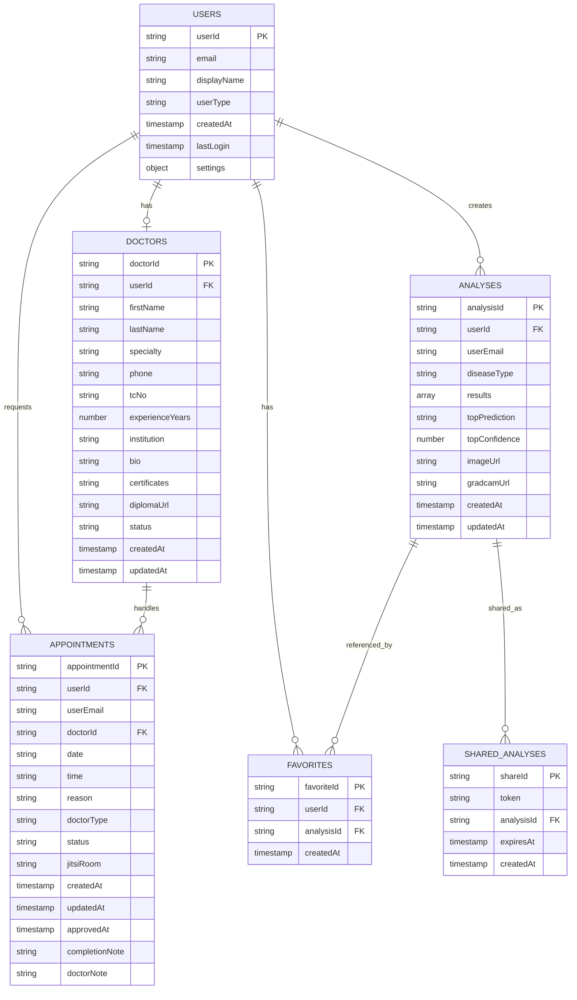

# MediAnalytica ER Diagram - Mermaid Code

Aşağıdaki Mermaid kodu ile MediAnalytica projesinin ER diyagramını oluşturabilirsiniz. Bu kod Mermaid Chart veya Mermaid destekleyen herhangi bir araçta kullanılabilir.

## Mermaid ER Diagram Code

## İlişkiler Açıklaması

- **USERS → DOCTORS (1:1)**: Bir kullanıcı en fazla bir doktor kaydına sahip olabilir (opsiyonel)
- **USERS → ANALYSES (1:N)**: Bir kullanıcı birden fazla analiz oluşturabilir
- **USERS → FAVORITES (1:N)**: Bir kullanıcı birden fazla favoriye sahip olabilir
- **USERS → APPOINTMENTS (1:N)**: Bir kullanıcı birden fazla randevu talep edebilir
- **DOCTORS → APPOINTMENTS (1:N)**: Bir doktor birden fazla randevuyu yönetebilir
- **ANALYSES → FAVORITES (1:N)**: Bir analiz birden fazla kullanıcının favorilerinde olabilir
- **ANALYSES → SHARED_ANALYSES (1:N)**: Bir analiz birden fazla paylaşım linkine sahip olabilir

## Notlar

- **PK**: Primary Key (Birincil Anahtar)
- **FK**: Foreign Key (Yabancı Anahtar - Firestore'da string referans olarak saklanır)
- Tüm koleksiyonlar Firebase Firestore (NoSQL) veritabanında bulunmaktadır
- Document ID'ler otomatik oluşturulan veya Firebase Authentication UID'leridir
