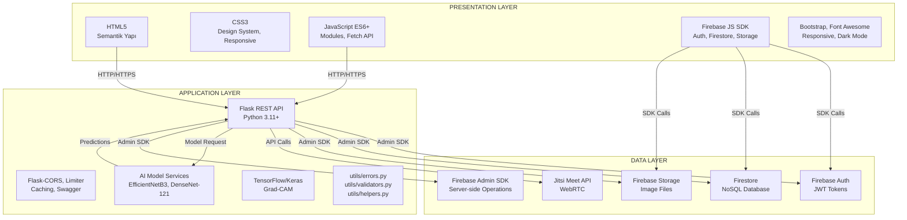

# Gemini'ye Katmanlı Mimari Yapısı Diyagramı Oluşturma Prompt'u

## ÖNEMLİ NOT - WATERMARK SORUNU:

Gemini görsellerinde sağ alt köşede watermark ekleniyor. Bu sorunu çözmek için:
1. Prompt'ta watermark olmamasını açıkça belirt
2. Alttan ekstra boşluk bırak (watermark alanı için)
3. VEYA alternatif araçlar kullan (Draw.io, Lucidchart)

## PROMPT (Gemini'ye Kopyala-Yapıştır):

```
Bir akademik bitirme projesi için katmanlı mimari yapısı diyagramı oluştur. 
Diyagram, MediAnalytica (tıbbi görüntü analizi ve tele-tıp platformu) için her katmanın iç bileşenlerini ve katmanlar arası iletişim yollarını detaylı olarak göstermelidir.

## ÖNEMLİ GEREKSİNİMLER:
- Görselde HİÇBİR watermark, logo veya amblem OLMAMALI
- Sağ alt köşede boşluk bırakma (watermark için alan bırakma)
- Alttan en az 100px boşluk bırak (watermark alanı için)
- Sadece mimari diyagram görünmeli, başka hiçbir marka/logo olmamalı
- Akademik rapor için kullanılacak, profesyonel görünüm

## KATMANLI MİMARİ YAPISI:

### 1. PRESENTATION LAYER (Sunum Katmanı - Üstte)

**Frontend Web Uygulaması:**
- **HTML5:**
  - Semantik yapı (header, nav, main, section, footer)
  - Form elementleri (input, select, button)
  - Meta tags (viewport, charset)
- **CSS3:**
  - Modern stil teknikleri (Flexbox, Grid)
  - CSS Variables (Design System)
  - Responsive media queries
  - Dark Mode desteği
  - Animations ve transitions
  - Glassmorphism efektleri
- **JavaScript (ES6+):**
  - ES Modules (import/export)
  - Async/await
  - Fetch API
  - Event listeners
  - LocalStorage API
  - Image compression (client-side)

**Ana Sayfalar:**
- login.html (Giriş/Kayıt sayfası)
- analyze.html (Ana analiz sayfası)
- appointment.html (Görüntülü görüşme sayfası)
- doctor-dashboard.html (Doktor paneli)
- doctor-register.html (Doktor kayıt sayfası)
- contact.html (İletişim formu)
- help.html (Yardım/FAQ sayfası)
- verify-email.html (Email doğrulama)
- reset-password.html (Şifre sıfırlama)

**Firebase JavaScript SDK:**
- firebase-app.js (Ana Firebase modülü)
- firebase-auth.js (Authentication)
- firebase-firestore.js (Firestore database)
- firebase-storage.js (File storage)
- firebase-analytics.js (Analytics)

**Kütüphaneler ve Framework'ler:**
- Bootstrap 4 (Grid system, utilities)
- Font Awesome (İkonlar)
- jsPDF (PDF rapor oluşturma)

**Özellikler:**
- Responsive tasarım (mobile-first)
- Dark Mode toggle
- Toast notifications
- Loading states (progress bar)
- Error handling ve user feedback
- Empty states
- ARIA labels (accessibility)

### 2. APPLICATION LAYER (Uygulama Katmanı - Ortada)

**Flask REST API (Backend):**
- **Python 3.11+:**
  - Modern Python özellikleri
  - Type hints
  - F-strings
- **Flask Web Framework:**
  - Route decorators (@app.route)
  - Request/Response handling
  - JSON serialization
  - Error handling
- **Flask-CORS:**
  - Cross-Origin Resource Sharing
  - Specific origins configuration
  - Methods ve headers kontrolü
- **Flask-Limiter:**
  - Rate limiting (DDoS koruması)
  - Per-endpoint limits
  - IP-based limiting
- **Flask-Caching:**
  - API response caching
  - Memory-based cache
  - Cache expiration
- **Flask-Swagger-UI:**
  - API dokümantasyonu
  - OpenAPI/Swagger spec
  - Interactive API explorer

**Ana API Dosyası:**
- auth_api.py
  - User authentication endpoints
  - Analysis management endpoints
  - Profile management endpoints
  - Favorites endpoints
  - Sharing endpoints
  - Statistics endpoints
  - Appointment endpoints
  - Doctor endpoints
  - Contact/Feedback endpoints

**AI Model Servisleri:**
- skin_disease_api.py
  - Model: EfficientNetB3
  - Hastalık türü: Deri hastalıkları (5 sınıf)
  - Preprocessing: Image resize, normalization
  - Postprocessing: Grad-CAM görselleştirme
- bone_disease_api.py
  - Model: DenseNet-121
  - Hastalık türü: Kemik hastalıkları (4 sınıf)
- lung_disease_api.py
  - Model: (Akciğer hastalıkları)
- eye_disease_api.py
  - Model: (Göz hastalıkları)

**TensorFlow/Keras:**
- Model loading (model.load_weights)
- Prediction (model.predict)
- Grad-CAM calculation
- Image preprocessing utilities

**Backend Utility Modülleri:**
- utils/errors.py
  - Custom exception classes (APIError, ValidationError)
  - Error handlers
  - Structured logging
- utils/validators.py
  - Input validation functions
  - Email validation
  - Password validation
  - Disease type validation
  - Analysis results validation
  - Pagination validation
  - Appointment data validation
- utils/helpers.py
  - Firestore timestamp serialization
  - String sanitization
  - Helper functions

**Firebase Admin SDK:**
- firebase_admin.auth (Token verification)
- firebase_admin.firestore (Database operations)
- firebase_admin.storage (File operations)

### 3. DATA LAYER (Veri Katmanı - Altta)

**Firebase Authentication:**
- Email/Password authentication
- JWT token üretimi
- Token doğrulama (verify_id_token)
- Email verification (sendEmailVerification)
- Password reset (sendPasswordResetEmail)
- User management (create_user, update_user, delete_user)

**Firebase Firestore (NoSQL Veritabanı):**
- **Koleksiyonlar:**
  - users (Kullanıcı profilleri)
    - Fields: email, displayName, createdAt, lastLogin, emailVerified
  - analyses (Analiz geçmişi)
    - Fields: userId, diseaseType, results, topPrediction, imageUrl, createdAt
  - favorites (Favori analizler)
    - Fields: userId, analysisId, createdAt
  - shared_analyses (Paylaşılan analizler)
    - Fields: token, analysisId, createdAt, expiresAt
  - appointments (Randevular)
    - Fields: userId, doctorId, date, time, reason, status, jitsiRoom, createdAt
  - doctors (Doktor kayıtları)
    - Fields: userId, specialization, experience, institution, status, createdAt
  - feedback (Kullanıcı geri bildirimleri)
    - Fields: userId, rating, comment, createdAt
  - contact_messages (İletişim form mesajları)
    - Fields: name, email, subject, message, createdAt
- **Özellikler:**
  - Real-time synchronization
  - Composite indexes (performans için)
  - Pagination (cursor-based)
  - Query filtering ve sorting
  - Server timestamps (SERVER_TIMESTAMP)

**Firebase Storage:**
- **Dosya Yapısı:**
  - /analysis_images/{userId}/{filename}
  - /profile_images/{userId}/{filename}
- **Özellikler:**
  - Security rules (kullanıcı bazlı erişim)
  - Download URL generation
  - File metadata
  - Upload progress tracking

**Jitsi Meet API:**
- Video konferans servisi
- WebRTC tabanlı görüntülü görüşme
- Room ID generation (unique, UUID)
- Share link functionality
- Audio/Video stream management

## KATMANLAR ARASI İLETİŞİM:

### Presentation → Application:
- **HTTP/HTTPS istekleri:**
  - GET /api/user/analyses (Analiz geçmişi)
  - POST /api/user/analyses (Yeni analiz kaydet)
  - GET /api/user/stats (İstatistikler)
  - GET /api/user/profile (Profil bilgileri)
  - PUT /api/user/profile (Profil güncelle)
  - POST /api/user/profile/photo (Profil fotoğrafı yükle)
  - POST /api/user/favorites (Favori ekle)
  - GET /api/user/favorites (Favorileri getir)
  - DELETE /api/user/favorites/<id> (Favori sil)
  - POST /api/share/analysis (Paylaşım linki oluştur)
  - GET /api/share/<token> (Paylaşım linki aç)
  - POST /api/appointments (Randevu oluştur)
  - GET /api/appointments (Randevuları getir)
  - POST /api/contact (İletişim formu)
  - POST /api/feedback (Geri bildirim)
- **Authorization Header:**
  - Bearer token (Firebase ID token)
- **Request Format:**
  - JSON (application/json)
  - FormData (file uploads için)

### Presentation → Data (Direct):
- **Firebase JavaScript SDK:**
  - Authentication (signInWithEmailAndPassword, createUserWithEmailAndPassword)
  - Firestore (collection, doc, get, set, update, delete)
  - Storage (ref, uploadBytes, getDownloadURL)
- **Real-time listeners:**
  - onSnapshot (Firestore real-time updates)

### Application → Data:
- **Firebase Admin SDK:**
  - auth.verify_id_token() (Token doğrulama)
  - db.collection().document().get() (Firestore read)
  - db.collection().document().set() (Firestore write)
  - db.collection().document().update() (Firestore update)
  - db.collection().document().delete() (Firestore delete)
  - storage.bucket().blob().upload_from_file() (Storage upload)
  - storage.bucket().blob().download_as_bytes() (Storage download)

### Application → AI Models:
- **Model Loading:**
  - model.load_weights() (TensorFlow/Keras)
- **Prediction:**
  - model.predict() (Image classification)
  - Grad-CAM calculation (Visualization)

## MİMARİ PRENSİPLER:

### 1. Separation of Concerns (Endişelerin Ayrılması):
- Her katman, kendi sorumluluğuna odaklanır
- Katmanlar birbirinden bağımsız çalışır
- Kod bakımı ve hata ayıklama kolaylaşır

### 2. Statelessness (Durumsuzluk):
- Uygulama katmanı durumsuz (stateless) tasarım
- Her API isteği kendi bağlamında işlenir
- Sunucu tarafında oturum durumu saklanmaz
- Yatay ölçeklenebilirlik artar

### 3. Loose Coupling (Gevşek Bağlantı):
- Katmanlar arası bağlantılar gevşek tasarım
- Bir katmandaki değişiklikler diğer katmanları minimum etkiler
- Modüler yapı

## DİYAGRAM GEREKSİNİMLERİ:

- **Her katmanı detaylı göster:**
  - Presentation Layer: Frontend bileşenleri, sayfalar, SDK'lar
  - Application Layer: Flask API, AI modelleri, utility modülleri
  - Data Layer: Firebase servisleri, Jitsi Meet

- **Katmanlar arası iletişimi oklarla göster:**
  - HTTP/HTTPS istekleri (mavi ok)
  - Firebase SDK çağrıları (yeşil ok)
  - Admin SDK çağrıları (turuncu ok)
  - Model prediction (mor ok)

- **Bileşenleri gruplandır:**
  - Frontend bileşenleri (HTML, CSS, JS)
  - Backend bileşenleri (Flask, AI Models)
  - Data bileşenleri (Firebase, Jitsi)

- **Detaylı etiketler:**
  - Her bileşenin adı ve açıklaması
  - İletişim protokolleri (HTTP, WebSocket, WebRTC)
  - Veri formatları (JSON, FormData)

- **Modern, profesyonel ve akademik görünüm:**
  - Temiz tasarım
  - Okunabilir font boyutları
  - Renkli ama profesyonel
  - Başlık: "MediAnalytica - Katmanlı Mimari Yapısı Diyagramı"

## DİYAGRAM YAPISI (Örnek):

```
┌─────────────────────────────────────────────────────────────┐
│              PRESENTATION LAYER                             │
│  ┌──────────────┐  ┌──────────────┐  ┌──────────────┐    │
│  │  HTML5       │  │  CSS3        │  │  JavaScript   │    │
│  │  Semantik    │  │  Design      │  │  ES6+ Modules │    │
│  │  Yapı        │  │  System      │  │  Fetch API    │    │
│  └──────────────┘  └──────────────┘  └──────────────┘    │
│  ┌──────────────┐  ┌──────────────┐  ┌──────────────┐    │
│  │  Firebase    │  │  Bootstrap    │  │  Responsive   │    │
│  │  JS SDK      │  │  Font Awesome│  │  Dark Mode   │    │
│  └──────────────┘  └──────────────┘  └──────────────┘    │
└─────────────────────────────────────────────────────────────┘
                    ↓ HTTP/HTTPS (Mavi Ok)
┌─────────────────────────────────────────────────────────────┐
│              APPLICATION LAYER                               │
│  ┌──────────────┐  ┌──────────────┐  ┌──────────────┐    │
│  │  Flask REST  │  │  Flask-CORS   │  │  Flask-       │    │
│  │  API         │  │  Limiter      │  │  Caching      │    │
│  └──────────────┘  └──────────────┘  └──────────────┘    │
│  ┌──────────────┐  ┌──────────────┐  ┌──────────────┐    │
│  │  AI Models   │  │  TensorFlow/  │  │  Grad-CAM    │    │
│  │  EfficientNet│  │  Keras        │  │  Visualization│    │
│  └──────────────┘  └──────────────┘  └──────────────┘    │
│  ┌──────────────┐  ┌──────────────┐  ┌──────────────┐    │
│  │  utils/       │  │  utils/       │  │  utils/       │    │
│  │  errors.py    │  │  validators.py│  │  helpers.py   │    │
│  └──────────────┘  └──────────────┘  └──────────────┘    │
└─────────────────────────────────────────────────────────────┘
                    ↓ Admin SDK (Turuncu Ok)
┌─────────────────────────────────────────────────────────────┐
│              DATA LAYER                                     │
│  ┌──────┐  ┌──────┐  ┌──────┐  ┌──────┐  ┌──────┐        │
│  │Auth  │  │Store│  │Storage│  │Jitsi │  │Admin │        │
│  │JWT   │  │NoSQL│  │Files  │  │Meet  │  │SDK   │        │
│  └──────┘  └──────┘  └──────┘  └──────┘  └──────┘        │
└─────────────────────────────────────────────────────────────┘
```

## ÇIKTI FORMATI:

- PNG veya JPG formatında
- Yüksek çözünürlük (300 DPI)
- Akademik rapor için uygun
- WATERMARK OLMAMALI - Alttan 100px boşluk bırak
- Sadece mimari diyagram görünmeli
- Profesyonel görünüm
- Türkçe veya İngilizce etiketler kullanılabilir
```

## ALTERNATİF YÖNTEMLER (WATERMARK SORUNU İÇİN):

### 1. Draw.io (diagrams.net) - ÖNERİLEN ⭐⭐⭐
**Watermark YOK, tamamen ücretsiz**

1. **https://app.diagrams.net/** adresine git
2. "Create New Diagram" → "Blank Diagram"
3. **Üç katmanı oluştur:**
   - Presentation Layer (üstte) - Büyük kutu
   - Application Layer (ortada) - Büyük kutu
   - Data Layer (altta) - Büyük kutu
4. **Her katmanın içine bileşenleri ekle:**
   - Presentation: HTML, CSS, JS, Firebase JS SDK, Bootstrap
   - Application: Flask API, AI Models, utils modülleri
   - Data: Firebase Auth, Firestore, Storage, Jitsi
5. **Okları ekle:**
   - HTTP istekleri (mavi)
   - Firebase SDK (yeşil)
   - Admin SDK (turuncu)
   - Model prediction (mor)
6. **Formatla ve Export → PNG** (watermark YOK!)

### 2. Lucidchart
**Watermark YOK (ücretsiz plan)**

1. https://www.lucidchart.com/ adresine git
2. "Create New Diagram" → "Blank Diagram"
3. Şekilleri sürükle-bırak ile ekle
4. Okları bağlantı çizgileri ile ekle
5. Export → PNG (watermark YOK)

### 3. Mermaid (Kod ile)
**Watermark YOK, GitHub'da otomatik render**

Aşağıdaki Mermaid kodunu kullan:



Bu kodu GitHub'da veya Mermaid Live Editor'da (https://mermaid.live/) kullan.

### 4. Microsoft Visio / PowerPoint
**Watermark YOK (Office paketi varsa)**

1. Visio veya PowerPoint'i aç
2. Şekilleri ekle (kutular, oklar)
3. Katmanları oluştur
4. Export → PNG (watermark YOK)

## ÖNERİLEN ADIMLAR:

### Seçenek 1: Gemini ile (Watermark sorunu var)
1. Prompt'u Gemini'ye gönder
2. Watermark'ı kırp veya alttan boşluk bırak
3. Veya görsel düzenleme programı ile watermark'ı kaldır

### Seçenek 2: Draw.io ile (ÖNERİLEN - Watermark YOK) ⭐
1. https://app.diagrams.net/ adresine git
2. Katmanlı mimari diyagramı oluştur
3. Export → PNG (watermark YOK)
4. Raporuna ekle

### Seçenek 3: Mermaid ile (Watermark YOK)
1. Yukarıdaki Mermaid kodunu kopyala
2. https://mermaid.live/ adresine git
3. Kodu yapıştır ve PNG olarak export et
4. Raporuna ekle

## WATERMARK KALDIRMA YÖNTEMLERİ:

Eğer Gemini'den görsel aldıysan ve watermark varsa:

1. **Görsel Düzenleme Programı ile:**
   - Photoshop, GIMP, Canva gibi programlarla watermark'ı kırp
   - Veya alttan 100px kes

2. **Online Araçlar:**
   - https://www.remove.bg/ (watermark kaldırma)
   - https://www.iloveimg.com/crop-image (kırpma)

3. **En İyi Çözüm:**
   - Draw.io kullan (watermark YOK, tamamen ücretsiz)

## DİYAGRAM RENKLERİ (Önerilen):

- **Presentation Layer:** Açık mavi (#E3F2FD)
- **Application Layer:** Açık yeşil (#E8F5E9)
- **Data Layer:** Açık turuncu (#FFF3E0)
- **HTTP Okları:** Mavi (#2196F3)
- **Firebase SDK Okları:** Yeşil (#4CAF50)
- **Admin SDK Okları:** Turuncu (#FF9800)
- **Model Prediction Okları:** Mor (#9C27B0)


