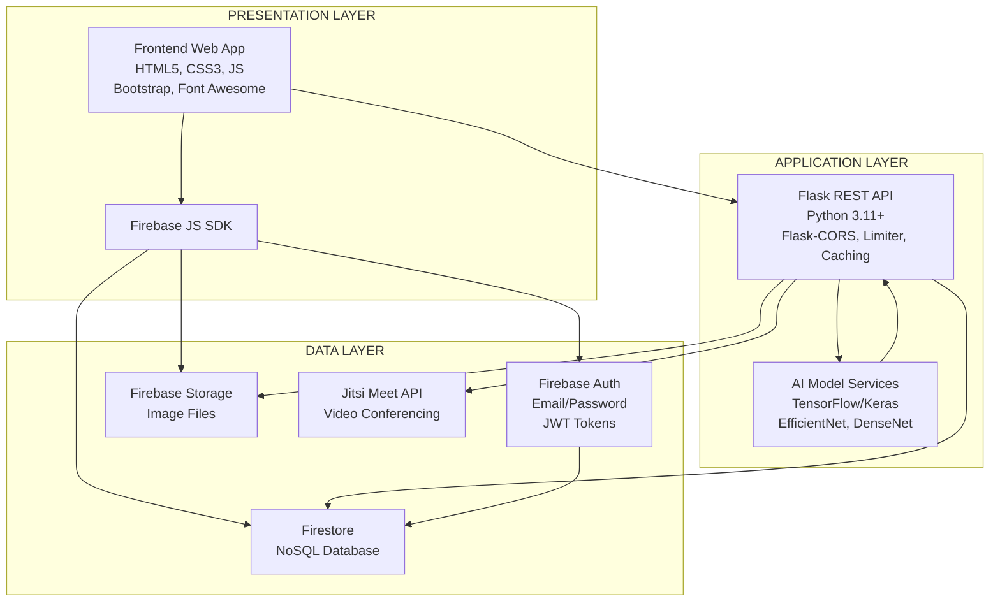

# Gemini'ye Sistem Mimarisi Diyagramı Oluşturma Prompt'u

## PROMPT (Gemini'ye Kopyala-Yapıştır):

```
Bir tıbbi görüntü analizi ve tele-tıp platformu için sistem mimarisi diyagramı oluştur. 
Diyagram, üç katmanlı (three-tier) mimari yapısını göstermelidir.

## MİMARİ YAPISI:

### 1. PRESENTATION LAYER (Sunum Katmanı - Üstte)
- **Frontend Web Uygulaması**
  - HTML5, CSS3, JavaScript (ES6+)
  - Bootstrap 4, Font Awesome
  - Firebase JavaScript SDK
  - Responsive tasarım, Dark Mode
  - Ana sayfalar: login.html, analyze.html, appointment.html, doctor-dashboard.html

### 2. APPLICATION LAYER (Uygulama Katmanı - Ortada)
- **Flask REST API (Backend)**
  - Python 3.11+, Flask Framework
  - Flask-CORS, Flask-Limiter, Flask-Caching
  - Flask-Swagger-UI (API dokümantasyonu)
  - auth_api.py (Ana API servisi)
  
- **AI Model Servisleri**
  - skin_disease_api.py (EfficientNetB3 - Deri hastalıkları)
  - bone_disease_api.py (DenseNet-121 - Kemik hastalıkları)
  - lung_disease_api.py (Akciğer hastalıkları)
  - eye_disease_api.py (Göz hastalıkları)
  - TensorFlow/Keras modelleri
  - Grad-CAM görselleştirme

### 3. DATA LAYER (Veri Katmanı - Altta)
- **Firebase Authentication**
  - Email/Password authentication
  - JWT token doğrulama
  - Email verification
  - Password reset

- **Firebase Firestore (NoSQL Veritabanı)**
  - Koleksiyonlar: users, analyses, favorites, shared_analyses, appointments, doctors
  - Real-time synchronization

- **Firebase Storage**
  - Görüntü dosyaları (analiz görüntüleri)
  - Profil fotoğrafları

- **Jitsi Meet API**
  - Video konferans servisi
  - WebRTC tabanlı görüntülü görüşme

## VERİ AKIŞI:

1. **Kullanıcı Kayıt/Giriş Akışı:**
   Frontend → Firebase Auth → Firestore (user kaydı)

2. **Görüntü Analizi Akışı:**
   Frontend → Flask API → AI Model → Sonuç → Firestore (analiz kaydı) → Frontend

3. **Analiz Geçmişi Akışı:**
   Frontend → Flask API → Firestore (sorgu) → Frontend

4. **Randevu ve Görüntülü Görüşme Akışı:**
   Frontend → Flask API → Firestore (randevu kaydı) → Jitsi Meet → Görüntülü görüşme

## DİYAGRAM GEREKSİNİMLERİ:

- Üç katmanı dikey olarak göster (Presentation üstte, Application ortada, Data altta)
- Her katmandaki bileşenleri kutular içinde göster
- Katmanlar arası veri akışını oklarla göster
- Firebase servislerini bir grup içinde göster
- AI modellerini ayrı bir bölüm olarak göster
- Jitsi Meet'i ayrı bir servis olarak göster
- Okları farklı renklerle göster (HTTP istekleri, veri akışı, authentication)
- Modern, profesyonel ve akademik bir görünüm
- Türkçe veya İngilizce etiketler kullanılabilir

## STİL:
- Temiz, modern tasarım
- Akademik rapor için uygun
- Renkli ama profesyonel
- Okunabilir font boyutları
- Başlık: "MediAnalytica - Sistem Mimarisi Diyagramı"
```

## ALTERNATİF YÖNTEMLER:

### 1. Draw.io (diagrams.net) - ÖNERİLEN
- Ücretsiz ve online
- https://app.diagrams.net/ adresine git
- "Create New Diagram" → "Blank Diagram"
- Şekilleri sürükle-bırak ile ekle
- Okları bağlantı çizgileri ile ekle
- Export → PNG/JPG olarak kaydet

### 2. Lucidchart
- Ücretsiz plan mevcut
- Profesyonel diyagramlar
- Kolay kullanım

### 3. Mermaid (Kod ile)
- Markdown benzeri syntax
- GitHub'da otomatik render
- Aşağıdaki kodu kullanabilirsin:



### 4. Microsoft Visio / PowerPoint
- Office paketi varsa kullanılabilir
- Şablonlar mevcut

## ÖNERİLEN ADIMLAR:

1. **Gemini'ye prompt'u gönder** ve diyagramı oluştur
2. **Diyagramı PNG/JPG olarak indir**
3. **RAPOR.txt dosyasına ekle** (Word/Google Docs kullanıyorsan direkt ekle)
4. **Veya Draw.io ile manuel olarak oluştur** (daha fazla kontrol için)

## DİYAGRAM ÖRNEĞİ YAPISI:

```
┌─────────────────────────────────────────────────────────┐
│           PRESENTATION LAYER                            │
│  ┌──────────────────┐  ┌──────────────────┐          │
│  │  Frontend Web    │  │  Firebase JS SDK │          │
│  │  HTML5/CSS3/JS   │  │                  │          │
│  └──────────────────┘  └──────────────────┘          │
└─────────────────────────────────────────────────────────┘
                        ↓ HTTP/HTTPS
┌─────────────────────────────────────────────────────────┐
│           APPLICATION LAYER                             │
│  ┌──────────────────┐  ┌──────────────────┐          │
│  │  Flask REST API  │  │  AI Model        │          │
│  │  Python/Flask    │  │  Services        │          │
│  └──────────────────┘  └──────────────────┘          │
└─────────────────────────────────────────────────────────┘
                        ↓ API Calls
┌─────────────────────────────────────────────────────────┐
│           DATA LAYER                                     │
│  ┌──────┐  ┌──────┐  ┌──────┐  ┌──────┐             │
│  │ Auth │  │Store │  │Storage│  │Jitsi │             │
│  └──────┘  └──────┘  └──────┘  └──────┘             │
└─────────────────────────────────────────────────────────┘
```

