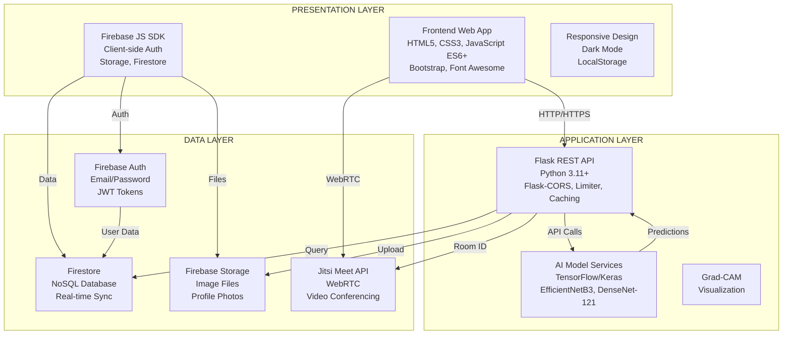

# Gemini'ye Sistem Genel Mimarisi Diyagramı Oluşturma Prompt'u

## ÖNEMLİ NOT - WATERMARK SORUNU:

Gemini görsellerinde sağ alt köşede watermark ekleniyor. Bu sorunu çözmek için:
1. Prompt'ta watermark olmamasını açıkça belirt
2. Alttan ekstra boşluk bırak (watermark alanı için)
3. VEYA alternatif araçlar kullan (Draw.io, Lucidchart)

## PROMPT (Gemini'ye Kopyala-Yapıştır):

```
Bir akademik bitirme projesi için sistem genel mimarisi diyagramı oluştur. 
Diyagram, tıbbi görüntü analizi ve tele-tıp platformu (MediAnalytica) için üç katmanlı (three-tier) mimari yapısını göstermelidir.

## ÖNEMLİ GEREKSİNİMLER:
- Görselde HİÇBİR watermark, logo veya amblem OLMAMALI
- Sağ alt köşede boşluk bırakma (watermark için alan bırakma)
- Alttan en az 100px boşluk bırak (watermark alanı için)
- Sadece mimari diyagram görünmeli, başka hiçbir marka/logo olmamalı
- Akademik rapor için kullanılacak, profesyonel görünüm

## ÜÇ KATMANLI MİMARİ YAPISI:

### 1. PRESENTATION LAYER (Sunum Katmanı - Üstte)
**Frontend Web Uygulaması:**
- HTML5, CSS3, JavaScript (ES6+)
- Bootstrap 4, Font Awesome (ikonlar)
- Firebase JavaScript SDK (client-side)
- Responsive tasarım (mobile-first)
- Dark Mode desteği
- Ana sayfalar:
  - login.html (Giriş/Kayıt)
  - analyze.html (Ana analiz sayfası)
  - appointment.html (Görüntülü görüşme)
  - doctor-dashboard.html (Doktor paneli)
  - contact.html, help.html (İletişim/Yardım)

**Özellikler:**
- Client-side image compression
- Toast notifications
- Loading states (progress bar)
- Error handling ve user feedback
- LocalStorage (token, theme preferences)

### 2. APPLICATION LAYER (Uygulama Katmanı - Ortada)
**Flask REST API (Backend):**
- Python 3.11+
- Flask Web Framework
- Flask-CORS (Cross-Origin Resource Sharing)
- Flask-Limiter (Rate limiting - DDoS koruması)
- Flask-Caching (API response caching)
- Flask-Swagger-UI (API dokümantasyonu)
- Ana dosya: auth_api.py
- Port: 5001 (default)

**AI Model Servisleri:**
- skin_disease_api.py
  - Model: EfficientNetB3
  - Hastalık türü: Deri hastalıkları (5 sınıf)
  - Grad-CAM görselleştirme
- bone_disease_api.py
  - Model: DenseNet-121
  - Hastalık türü: Kemik hastalıkları (4 sınıf)
- lung_disease_api.py
  - Model: (Akciğer hastalıkları)
- eye_disease_api.py
  - Model: (Göz hastalıkları)
- TensorFlow/Keras kütüphaneleri
- Model yükleme ve tahmin işlemleri

**Backend Özellikleri:**
- JWT token doğrulama (Firebase Admin SDK)
- Input validation (utils/validators.py)
- Error handling (utils/errors.py)
- Helper functions (utils/helpers.py)
- Structured logging

### 3. DATA LAYER (Veri Katmanı - Altta)
**Firebase Authentication:**
- Email/Password authentication
- JWT token üretimi ve doğrulama
- Email verification (sendEmailVerification)
- Password reset (sendPasswordResetEmail)
- User management (create, update, delete)

**Firebase Firestore (NoSQL Veritabanı):**
- Koleksiyonlar:
  - users (Kullanıcı profilleri)
  - analyses (Analiz geçmişi)
  - favorites (Favori analizler)
  - shared_analyses (Paylaşılan analizler)
  - appointments (Randevular)
  - doctors (Doktor kayıtları)
  - feedback (Kullanıcı geri bildirimleri)
  - contact_messages (İletişim form mesajları)
- Real-time synchronization
- Composite indexes (performans için)
- Pagination (cursor-based)

**Firebase Storage:**
- Görüntü dosyaları:
  - /analysis_images/{userId}/{filename}
  - /profile_images/{userId}/{filename}
- Security rules (kullanıcı bazlı erişim)
- Download URL generation

**Jitsi Meet API:**
- Video konferans servisi
- WebRTC tabanlı görüntülü görüşme
- Room ID generation (unique)
- Share link functionality

## VERİ AKIŞI VE İLETİŞİM:

### 1. Kullanıcı Kayıt/Giriş Akışı:
```
Frontend (login.html)
  ↓ HTTP POST
Firebase Authentication
  ↓ JWT Token
Frontend (localStorage)
  ↓ Authorization Header
Flask API (auth_api.py)
  ↓ Token Verification
Firebase Admin SDK
  ↓ User Data
Firestore (users collection)
```

### 2. Görüntü Analizi Akışı:
```
Frontend (analyze.html)
  ↓ HTTP POST (FormData)
Flask API (skin_disease_api.py)
  ↓ Image Preprocessing
AI Model (EfficientNetB3)
  ↓ Prediction + Grad-CAM
Flask API (JSON response)
  ↓ Analysis Data
Frontend (display results)
  ↓ HTTP POST
Flask API (auth_api.py)
  ↓ Image Upload
Firebase Storage
  ↓ Download URL
Firestore (analyses collection)
```

### 3. Analiz Geçmişi Akışı:
```
Frontend (analyze.html)
  ↓ HTTP GET (Authorization Header)
Flask API (auth_api.py)
  ↓ Token Verification
Firebase Admin SDK
  ↓ Firestore Query
Firestore (analyses collection)
  ↓ JSON Response (pagination)
Frontend (display history)
```

### 4. Randevu ve Görüntülü Görüşme Akışı:
```
Frontend (analyze.html)
  ↓ HTTP POST (appointment data)
Flask API (auth_api.py)
  ↓ Create Appointment
Firestore (appointments collection)
  ↓ Jitsi Room ID
Frontend (appointment.html)
  ↓ Jitsi Meet API
Jitsi Meet (WebRTC)
  ↓ Video/Audio Stream
Görüntülü Görüşme
```

## İLETİŞİM PROTOKOLLERİ:

1. **HTTP/HTTPS:**
   - Tüm API istekleri HTTP/HTTPS üzerinden
   - HTTPS production ortamında (güvenli veri iletişimi)

2. **REST (Representational State Transfer):**
   - RESTful API tasarımı
   - HTTP metodları: GET, POST, PUT, DELETE
   - Resource-based URLs

3. **JSON (JavaScript Object Notation):**
   - Tüm API istekleri ve yanıtları JSON formatında
   - Hafif ve okunabilir format

4. **WebSocket (Jitsi Meet):**
   - Gerçek zamanlı ses ve video iletişimi
   - WebRTC protokolü

## DİYAGRAM GEREKSİNİMLERİ:

- **Üç katmanı dikey olarak göster:**
  - Presentation Layer (üstte)
  - Application Layer (ortada)
  - Data Layer (altta)

- **Her katmandaki bileşenleri kutular içinde göster:**
  - Frontend bileşenleri (HTML, CSS, JS, Firebase JS SDK)
  - Backend bileşenleri (Flask API, AI Models)
  - Data bileşenleri (Firebase Auth, Firestore, Storage, Jitsi)

- **Katmanlar arası veri akışını oklarla göster:**
  - HTTP/HTTPS istekleri (mavi ok)
  - Authentication akışı (yeşil ok)
  - Veri akışı (turuncu ok)
  - WebRTC akışı (mor ok)

- **Firebase servislerini bir grup içinde göster:**
  - Firebase Authentication
  - Firebase Firestore
  - Firebase Storage

- **AI modellerini ayrı bir bölüm olarak göster:**
  - EfficientNetB3 (Deri)
  - DenseNet-121 (Kemik)
  - Diğer modeller

- **Jitsi Meet'i ayrı bir servis olarak göster:**
  - WebRTC tabanlı video konferans

- **Okları farklı renklerle göster:**
  - HTTP istekleri: Mavi
  - Authentication: Yeşil
  - Veri akışı: Turuncu
  - WebRTC: Mor

- **Modern, profesyonel ve akademik bir görünüm:**
  - Temiz tasarım
  - Okunabilir font boyutları
  - Renkli ama profesyonel
  - Başlık: "MediAnalytica - Sistem Genel Mimarisi Diyagramı"

## DİYAGRAM YAPISI (Örnek):

```
┌─────────────────────────────────────────────────────────────┐
│              PRESENTATION LAYER                             │
│  ┌──────────────┐  ┌──────────────┐  ┌──────────────┐    │
│  │  Frontend    │  │  Firebase    │  │  Responsive   │    │
│  │  HTML/CSS/JS │  │  JS SDK      │  │  Design       │    │
│  └──────────────┘  └──────────────┘  └──────────────┘    │
└─────────────────────────────────────────────────────────────┘
                    ↓ HTTP/HTTPS (Mavi Ok)
┌─────────────────────────────────────────────────────────────┐
│              APPLICATION LAYER                              │
│  ┌──────────────┐  ┌──────────────┐  ┌──────────────┐    │
│  │  Flask REST  │  │  AI Model    │  │  Rate Limit   │    │
│  │  API         │  │  Services    │  │  & Caching   │    │
│  └──────────────┘  └──────────────┘  └──────────────┘    │
└─────────────────────────────────────────────────────────────┘
                    ↓ API Calls (Turuncu Ok)
┌─────────────────────────────────────────────────────────────┐
│              DATA LAYER                                     │
│  ┌──────┐  ┌──────┐  ┌──────┐  ┌──────┐  ┌──────┐        │
│  │Auth  │  │Store│  │Storage│  │Jitsi │  │Admin │        │
│  └──────┘  └──────┘  └──────┘  └──────┘  └──────┘        │
└─────────────────────────────────────────────────────────────┘
```

## ÇIKTI FORMATI:

- PNG veya JPG formatında
- Yüksek çözünürlük (300 DPI)
- Akademik rapor için uygun
- WATERMARK OLMAMALI - Alttan 100px boşluk bırak
- Sadece mimari diyagram görünmeli
- Profesyonel görünüm
- Türkçe veya İngilizce etiketler kullanılabilir
```

## ALTERNATİF YÖNTEMLER (WATERMARK SORUNU İÇİN):

### 1. Draw.io (diagrams.net) - ÖNERİLEN ⭐⭐⭐
**Watermark YOK, tamamen ücretsiz**

1. **https://app.diagrams.net/** adresine git
2. "Create New Diagram" → "Blank Diagram"
3. **Katmanları oluştur:**
   - Üç büyük kutu çiz (Presentation, Application, Data)
   - Her katmanın içine bileşenleri ekle
   - Okları bağlantı çizgileri ile ekle
4. **Formatla:**
   - Her katman için farklı renk
   - Okları farklı renklerle göster
   - Başlık ekle
5. **Export → PNG** (watermark YOK!)

### 2. Lucidchart
**Watermark YOK (ücretsiz plan)**

1. https://www.lucidchart.com/ adresine git
2. "Create New Diagram" → "Blank Diagram"
3. Şekilleri sürükle-bırak ile ekle
4. Okları bağlantı çizgileri ile ekle
5. Export → PNG (watermark YOK)

### 3. Mermaid (Kod ile)
**Watermark YOK, GitHub'da otomatik render**

Aşağıdaki Mermaid kodunu kullan:



Bu kodu GitHub'da veya Mermaid Live Editor'da (https://mermaid.live/) kullan.

### 4. Microsoft Visio / PowerPoint
**Watermark YOK (Office paketi varsa)**

1. Visio veya PowerPoint'i aç
2. Şekilleri ekle (kutular, oklar)
3. Katmanları oluştur
4. Export → PNG (watermark YOK)

## ÖNERİLEN ADIMLAR:

### Seçenek 1: Gemini ile (Watermark sorunu var)
1. Prompt'u Gemini'ye gönder
2. Watermark'ı kırp veya alttan boşluk bırak
3. Veya görsel düzenleme programı ile watermark'ı kaldır

### Seçenek 2: Draw.io ile (ÖNERİLEN - Watermark YOK) ⭐
1. https://app.diagrams.net/ adresine git
2. Mimari diyagramı oluştur
3. Export → PNG (watermark YOK)
4. Raporuna ekle

### Seçenek 3: Mermaid ile (Watermark YOK)
1. Yukarıdaki Mermaid kodunu kopyala
2. https://mermaid.live/ adresine git
3. Kodu yapıştır ve PNG olarak export et
4. Raporuna ekle

## WATERMARK KALDIRMA YÖNTEMLERİ:

Eğer Gemini'den görsel aldıysan ve watermark varsa:

1. **Görsel Düzenleme Programı ile:**
   - Photoshop, GIMP, Canva gibi programlarla watermark'ı kırp
   - Veya alttan 100px kes

2. **Online Araçlar:**
   - https://www.remove.bg/ (watermark kaldırma)
   - https://www.iloveimg.com/crop-image (kırpma)

3. **En İyi Çözüm:**
   - Draw.io kullan (watermark YOK, tamamen ücretsiz)

## DİYAGRAM RENKLERİ (Önerilen):

- **Presentation Layer:** Açık mavi (#E3F2FD)
- **Application Layer:** Açık yeşil (#E8F5E9)
- **Data Layer:** Açık turuncu (#FFF3E0)
- **HTTP Okları:** Mavi (#2196F3)
- **Auth Okları:** Yeşil (#4CAF50)
- **Data Okları:** Turuncu (#FF9800)
- **WebRTC Okları:** Mor (#9C27B0)

