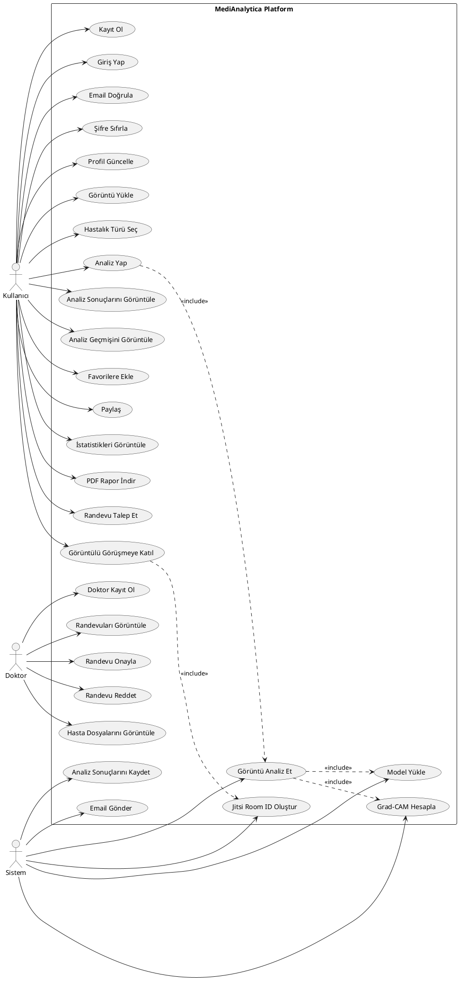

# Gemini'ye Use Case Diyagramı Oluşturma Prompt'u

## PROMPT (Gemini'ye Kopyala-Yapıştır):

```
Bir tıbbi görüntü analizi ve tele-tıp platformu için UML Use Case diyagramı oluştur. 
Diyagram, akademik bir bitirme projesi raporu için kullanılacak.

## AKTÖRLER (ACTORS):

1. **Kullanıcı (User/Patient)** - Sol tarafta, stick figure
   - Normal kullanıcılar, hasta olarak kayıt olan kişiler

2. **Doktor (Doctor)** - Sağ tarafta, stick figure
   - Doktor olarak kayıt olan ve randevu yöneten kişiler

3. **Sistem (System)** - Alt tarafta, stick figure veya "System" yazısı
   - Otomatik işlemleri gerçekleştiren sistem bileşenleri

## KULLANICI (USER) USE CASE'LERİ:

### Kimlik Doğrulama Grubu:
- Kayıt Ol (Register)
- Giriş Yap (Login)
- Email Doğrula (Verify Email)
- Şifre Sıfırla (Reset Password)
- Profil Güncelle (Update Profile)
- Çıkış Yap (Logout)

### Görüntü Analizi Grubu:
- Görüntü Yükle (Upload Image)
- Hastalık Türü Seç (Select Disease Type)
  - Alt use case'ler: Deri Seç, Kemik Seç, Akciğer Seç, Göz Seç
- Analiz Yap (Analyze Image) - <<include>> Sistem: Görüntü Analiz Et
- Analiz Sonuçlarını Görüntüle (View Analysis Results)
- Grad-CAM Görselleştirmesini Görüntüle (View Grad-CAM Visualization)

### Analiz Geçmişi Grubu:
- Analiz Geçmişini Görüntüle (View Analysis History)
- Analizleri Filtrele (Filter Analyses)
  - Alt use case'ler: Hastalık Türüne Göre Filtrele, Tarihe Göre Filtrele
- Analizleri Sayfalama ile Görüntüle (View Paginated Analyses)

### Favoriler Grubu:
- Favorilere Ekle (Add to Favorites)
- Favorileri Görüntüle (View Favorites)
- Favorilerden Kaldır (Remove from Favorites)

### Paylaşım Grubu:
- Analiz Sonuçlarını Paylaş (Share Analysis Results)
- Paylaşım Linkini Görüntüle (View Share Link)

### İstatistikler Grubu:
- İstatistikleri Görüntüle (View Statistics)
  - Alt use case'ler: Toplam Analiz Sayısı, Hastalık Türüne Göre Dağılım, En Çok Analiz Edilen Tür, Son Analiz Tarihi

### PDF Rapor Grubu:
- PDF Rapor İndir (Download PDF Report)

### Randevu ve Görüntülü Görüşme Grubu:
- Randevu Talep Et (Request Appointment)
- Randevuları Görüntüle (View Appointments)
- Görüntülü Görüşmeye Katıl (Join Video Call) - <<include>> Sistem: Jitsi Room Oluştur
- Görüntülü Görüşme Linkini Paylaş (Share Video Call Link)

## DOKTOR (DOCTOR) USE CASE'LERİ:

### Doktor Kayıt ve Yönetim:
- Doktor Kayıt Ol (Doctor Register)
  - Uzmanlık, diploma, deneyim bilgileri ile kayıt
- Doktor Paneline Eriş (Access Doctor Dashboard)

### Randevu Yönetimi:
- Randevuları Görüntüle (View Appointments)
- Randevu Onayla (Approve Appointment)
- Randevu Reddet (Reject Appointment)

### Hasta Yönetimi:
- Hasta Dosyalarını Görüntüle (View Patient Files)
- Görüntülü Görüşmeye Katıl (Join Video Call)

## SİSTEM (SYSTEM) USE CASE'LERİ:

### Otomatik İşlemler:
- Model Yükle (Load Model)
  - Alt use case'ler: EfficientNet Yükle, DenseNet Yükle
- Görüntü Analiz Et (Analyze Image)
  - <<include>> Model Yükle
  - <<include>> Grad-CAM Hesapla
- Grad-CAM Hesapla (Calculate Grad-CAM)
- Analiz Sonuçlarını Kaydet (Save Analysis Results)
- Randevu Onayla (Auto-approve Appointment) - Test amaçlı otomatik onay
- Jitsi Room ID Oluştur (Generate Jitsi Room ID)
- Email Gönder (Send Email)
  - Alt use case'ler: Doğrulama Email'i Gönder, Şifre Sıfırlama Email'i Gönder

## İLİŞKİLER (RELATIONSHIPS):

### Include İlişkileri (<<include>>):
- "Analiz Yap" <<include>> "Görüntü Analiz Et"
- "Görüntü Analiz Et" <<include>> "Model Yükle"
- "Görüntü Analiz Et" <<include>> "Grad-CAM Hesapla"
- "Görüntülü Görüşmeye Katıl" <<include>> "Jitsi Room ID Oluştur"

### Extend İlişkileri (<<extend>>):
- "Email Gönder" <<extend>> "Kayıt Ol" (kayıt sonrası doğrulama email'i)
- "Email Gönder" <<extend>> "Şifre Sıfırla" (şifre sıfırlama email'i)

### Genelleme (Inheritance):
- "Hastalık Türü Seç" genellemesi:
  - "Deri Seç"
  - "Kemik Seç"
  - "Akciğer Seç"
  - "Göz Seç"

## DİYAGRAM GEREKSİNİMLERİ:

- UML Use Case diyagramı standardına uygun
- Aktörler stick figure olarak gösterilmeli
- Use case'ler oval (elips) içinde
- Sistem sınırı (system boundary) ile gruplandırılmalı:
  - "MediAnalytica Platform" ana sistem sınırı
  - Alt sistemler: "Kimlik Doğrulama Sistemi", "Analiz Sistemi", "Randevu Sistemi"
- Include ve extend ilişkileri kesikli ok ile gösterilmeli
- Aktör-use case ilişkileri düz çizgi ile gösterilmeli
- Profesyonel ve akademik görünüm
- Türkçe veya İngilizce etiketler kullanılabilir
- Renkli ama okunabilir
- Başlık: "MediAnalytica - Use Case Diyagramı"

## DİYAGRAM YAPISI:

```
                    [Kullanıcı]
                         |
        ┌────────────────┼────────────────┐
        |                |                |
    [Kayıt Ol]    [Giriş Yap]    [Profil Güncelle]
        |                |                |
        └────────────────┼────────────────┘
                         |
        ┌────────────────┼────────────────┐
        |                |                |
    [Görüntü Yükle] [Analiz Yap] [Sonuçları Görüntüle]
        |                |                |
        └────────────────┼────────────────┘
                         |
                    [Sistem]
                         |
        ┌────────────────┼────────────────┐
        |                |                |
    [Model Yükle] [Görüntü Analiz Et] [Grad-CAM Hesapla]
```

## ÖNEMLİ NOTLAR:

1. **Sistem Sınırları:**
   - Ana sistem: "MediAnalytica Platform"
   - Alt sistemler gruplandırılmalı

2. **Use Case Grupları:**
   - Kimlik Doğrulama (sol üst)
   - Görüntü Analizi (orta üst)
   - Analiz Geçmişi (sağ üst)
   - Randevu ve Görüntülü Görüşme (alt)
   - Doktor İşlemleri (sağ taraf)

3. **İlişki Tipleri:**
   - Düz çizgi: Aktör-use case ilişkisi
   - Kesikli ok + <<include>>: Include ilişkisi
   - Kesikli ok + <<extend>>: Extend ilişkisi
   - Üçgen ok: Genelleme (inheritance)

4. **Renkler:**
   - Kullanıcı use case'leri: Mavi tonları
   - Doktor use case'leri: Yeşil tonları
   - Sistem use case'leri: Gri tonları
   - Aktörler: Siyah veya koyu renk

## ÇIKTI FORMATI:

- PNG veya JPG formatında
- Yüksek çözünürlük (300 DPI)
- Akademik rapor için uygun
- Okunabilir font boyutları
- Profesyonel görünüm
```

## ALTERNATİF YÖNTEMLER:

### 1. Draw.io (diagrams.net) - ÖNERİLEN
- https://app.diagrams.net/ adresine git
- "Create New Diagram" → "Blank Diagram"
- Sol panelden "UML" → "Use Case" şekillerini seç
- Aktörleri ve use case'leri ekle
- İlişkileri çiz
- Export → PNG olarak kaydet

### 2. Lucidchart
- Use Case diyagramı şablonu kullan
- Profesyonel görünüm

### 3. PlantUML (Kod ile)


PlantUML kodu: https://www.plantuml.com/plantuml/uml/ adresinde render edilebilir.

## ÖNERİLEN ADIMLAR:

1. **Gemini'ye prompt'u gönder** ve diyagramı oluştur
2. **Diyagramı PNG/JPG olarak indir**
3. **RAPOR.txt dosyasına ekle**
4. **Veya Draw.io ile manuel oluştur** (daha fazla kontrol için)

## DİYAGRAM KONTROL LİSTESİ:

- [ ] 3 aktör var (Kullanıcı, Doktor, Sistem)
- [ ] Tüm use case'ler eklendi (FR1-FR10'dan)
- [ ] Include ilişkileri gösterildi
- [ ] Extend ilişkileri gösterildi (varsa)
- [ ] Sistem sınırı çizildi
- [ ] Use case'ler mantıklı gruplandırıldı
- [ ] Renkler profesyonel
- [ ] Font boyutları okunabilir
- [ ] Başlık eklendi

