# Gemini'ye Veri Akışı Diyagramı Oluşturma Prompt'u

## ÖNEMLİ NOT - WATERMARK SORUNU:

Gemini görsellerinde sağ alt köşede watermark ekleniyor. Bu sorunu çözmek için:
1. Prompt'ta watermark olmamasını açıkça belirt
2. Alttan ekstra boşluk bırak (watermark alanı için)
3. VEYA alternatif araçlar kullan (Draw.io, Lucidchart)

## PROMPT (Gemini'ye Kopyala-Yapıştır):

```
Bir akademik bitirme projesi için veri akışı diyagramı oluştur. 
Diyagram, MediAnalytica (tıbbi görüntü analizi ve tele-tıp platformu) için farklı senaryolardaki veri akışını adım adım göstermelidir.

## ÖNEMLİ GEREKSİNİMLER:
- Görselde HİÇBİR watermark, logo veya amblem OLMAMALI
- Sağ alt köşede boşluk bırakma (watermark için alan bırakma)
- Alttan en az 100px boşluk bırak (watermark alanı için)
- Sadece veri akışı diyagramı görünmeli, başka hiçbir marka/logo olmamalı
- Akademik rapor için kullanılacak, profesyonel görünüm

## VERİ AKIŞI SENARYOLARI:

### 1. Kullanıcı Kayıt ve Giriş Akışı

**Adımlar:**
1. Kullanıcı, frontend üzerinden (login.html) email ve şifre ile kayıt olur veya giriş yapar
2. Frontend, Firebase Authentication JavaScript SDK kullanarak Firebase'e istek gönderir
   - Kayıt: `createUserWithEmailAndPassword(auth, email, password)`
   - Giriş: `signInWithEmailAndPassword(auth, email, password)`
3. Firebase Authentication, kullanıcıyı doğrular ve bir ID token döndürür
4. Frontend, bu token'ı localStorage'da saklar (`localStorage.setItem("firebase_id_token", token)`)
5. Sonraki API isteklerinde, bu token Authorization header'ında gönderilir
   - Header: `Authorization: Bearer <token>`
6. Backend (auth_api.py), token'ı Firebase Admin SDK ile doğrular
   - `auth.verify_id_token(token)`
7. Doğrulama başarılıysa, kullanıcı verileri Firestore'a kaydedilir veya güncellenir
   - Collection: `users`
   - Document: `{userId}`
   - Fields: email, displayName, createdAt, lastLogin, emailVerified

**Veri Formatları:**
- Request: JSON (email, password)
- Response: JSON (uid, email, token)
- Storage: localStorage (token)

### 2. Görüntü Analizi Akışı

**Adımlar:**
1. Kullanıcı, frontend üzerinden (analyze.html) görüntü yükler ve hastalık türü seçer
   - Görüntü: File input (JPEG, PNG)
   - Hastalık türü: Select dropdown (skin, bone, lung, eye)
2. Frontend, görüntüyü client-side'da sıkıştırır (image compression)
   - Max size: 10MB
   - Format: JPEG/PNG
3. Frontend, görüntüyü seçilen hastalık türüne göre uygun backend API'ye gönderir
   - Deri: `POST http://localhost:5003/skin_disease_api`
   - Kemik: `POST http://localhost:5004/bone_disease_api`
   - Akciğer: `POST http://localhost:5005/lung_disease_api`
   - Göz: `POST http://localhost:5006/eye_disease_api`
   - Format: FormData (multipart/form-data)
4. Backend API, görüntüyü alır ve ön işleme (preprocessing) yapar
   - Resize: Model input size'a göre (örn: 224x224)
   - Normalization: [0, 1] aralığına normalize et
   - Array conversion: NumPy array'e çevir
5. Backend, derin öğrenme modeli ile analiz eder
   - Model loading: `model.load_weights()`
   - Prediction: `model.predict(image_array)`
   - Grad-CAM: Görselleştirme için heatmap hesapla
6. Analiz sonuçları, frontend'e JSON formatında döndürülür
   - Format: `{success: true, results: [...], topPrediction: "...", gradCamUrl: "..."}`
7. Frontend, sonuçları kullanıcıya gösterir
8. Frontend, analizi Firebase'e kaydetmek için `auth_api.py`'ye istek gönderir
   - Endpoint: `POST /api/user/analyses`
   - Authorization: Bearer token
   - Body: JSON (diseaseType, results, topPrediction, imageUrl)
9. Backend (auth_api.py), görüntüyü Firebase Storage'a yükler
   - Path: `/analysis_images/{userId}/{filename}`
   - Upload: `storage.bucket().blob().upload_from_file()`
10. Backend, analiz verilerini Firestore'a kaydeder
    - Collection: `analyses`
    - Document: Auto-generated ID
    - Fields: userId, diseaseType, results, topPrediction, imageUrl, createdAt
11. Frontend, başarı mesajını gösterir (toast notification)

**Veri Formatları:**
- Request: FormData (image file)
- Response: JSON (results, predictions, gradCamUrl)
- Storage: Firebase Storage (image files)
- Database: Firestore (analysis data)

### 3. Analiz Geçmişi Akışı

**Adımlar:**
1. Kullanıcı, analiz geçmişini görüntülemek istediğinde, frontend `auth_api.py`'nin endpoint'ine GET isteği gönderir
   - Endpoint: `GET /api/user/analyses`
   - Authorization: Bearer token
   - Query params: page=1, per_page=10 (pagination)
2. Backend, Authorization header'ından token'ı alır ve doğrular
   - `auth.verify_id_token(token)`
   - UID çıkarılır
3. Backend, Firestore'dan kullanıcının analizlerini sorgular
   - Collection: `analyses`
   - Query: `where("userId", "==", uid).order_by("createdAt", direction=firestore.Query.DESCENDING).limit(per_page)`
4. Backend, sonuçları JSON formatında frontend'e döndürür
   - Format: `{success: true, data: [...], pagination: {page, per_page, total}}`
5. Frontend, sonuçları kullanıcı arayüzünde gösterir
   - Liste formatında (card layout)
   - Her analiz için: tarih, hastalık türü, en yüksek tahmin, görüntü thumbnail
6. Kullanıcı, sayfalama (pagination) ile daha fazla analiz yükleyebilir

**Veri Formatları:**
- Request: HTTP GET (Authorization header)
- Response: JSON (analyses array, pagination info)
- Database: Firestore query

### 4. Randevu ve Görüntülü Görüşme Akışı

**Adımlar:**
1. Kullanıcı, randevu oluşturmak istediğinde, frontend formu doldurur
   - Fields: date, time, reason, doctorId (opsiyonel)
   - Sayfa: analyze.html (randevu modal)
2. Frontend, randevu verilerini `auth_api.py`'ye POST isteği gönderir
   - Endpoint: `POST /api/appointments`
   - Authorization: Bearer token
   - Body: JSON (date, time, reason, doctorId)
3. Backend, token'ı doğrular ve randevu oluşturur
   - Unique Jitsi Room ID oluşturur (UUID)
   - Status: "approved" (otomatik onay)
4. Backend, randevu verilerini Firestore'a kaydeder
   - Collection: `appointments`
   - Document: Auto-generated ID
   - Fields: userId, doctorId, date, time, reason, status, jitsiRoom, createdAt
5. Frontend, başarı mesajını gösterir ve randevu listesini günceller
6. Kullanıcı, randevuya katılmak istediğinde, "Görüntülü Görüşmeye Katıl" butonuna tıklar
7. Frontend, `appointment.html` sayfasına yönlendirir
   - URL: `appointment.html?id={appointmentId}`
8. Frontend, appointment ID'yi URL'den alır ve backend'e istek gönderir
   - Endpoint: `GET /api/appointments/{appointmentId}/join`
   - Authorization: Bearer token
9. Backend, Jitsi Meet URL'ini döndürür
   - Format: `https://meet.jit.si/{jitsiRoom}`
10. Frontend, Jitsi Meet iframe'ini yükler
    - Iframe src: Jitsi Meet URL
    - WebRTC bağlantısı kurulur
11. Kullanıcı, görüntülü görüşmeye katılır
    - Audio/Video stream (WebRTC)
    - Real-time communication

**Veri Formatları:**
- Request: JSON (appointment data)
- Response: JSON (appointmentId, jitsiRoom)
- Database: Firestore (appointment data)
- Video: WebRTC (Jitsi Meet)

## İLETİŞİM PROTOKOLLERİ:

1. **HTTP/HTTPS:**
   - Tüm API istekleri HTTP veya HTTPS protokolü üzerinden
   - HTTPS production ortamında (güvenli veri iletişimi)
   - Port: 5001 (auth_api.py), 5003-5006 (AI model APIs)

2. **REST (Representational State Transfer):**
   - RESTful API tasarımı
   - HTTP metodları: GET, POST, PUT, DELETE
   - Resource-based URLs
   - Stateless istekler

3. **JSON (JavaScript Object Notation):**
   - Tüm API istekleri ve yanıtları JSON formatında
   - Hafif ve okunabilir format
   - UTF-8 encoding

4. **FormData:**
   - Dosya yükleme için multipart/form-data
   - Görüntü dosyaları için kullanılır

5. **WebSocket (Jitsi Meet):**
   - Gerçek zamanlı ses ve video iletişimi
   - WebRTC protokolü
   - Peer-to-peer bağlantı

## DİYAGRAM GEREKSİNİMLERİ:

- **Dört senaryoyu ayrı ayrı göster:**
  - Senaryo 1: Kullanıcı Kayıt/Giriş Akışı
  - Senaryo 2: Görüntü Analizi Akışı
  - Senaryo 3: Analiz Geçmişi Akışı
  - Senaryo 4: Randevu ve Görüntülü Görüşme Akışı

- **Her senaryo için adım adım akış:**
  - Başlangıç noktası (Kullanıcı/Frontend)
  - Ara adımlar (Backend, Firebase, AI Models)
  - Bitiş noktası (Sonuç/Frontend)

- **Bileşenleri kutular içinde göster:**
  - Frontend (login.html, analyze.html, appointment.html)
  - Backend (auth_api.py, skin_disease_api.py, vb.)
  - Firebase (Auth, Firestore, Storage)
  - AI Models (EfficientNetB3, DenseNet-121)
  - Jitsi Meet

- **Veri akışını oklarla göster:**
  - HTTP istekleri (mavi ok)
  - Firebase SDK çağrıları (yeşil ok)
  - Admin SDK çağrıları (turuncu ok)
  - Model prediction (mor ok)
  - WebRTC (pembe ok)

- **Her ok üzerinde veri formatını belirt:**
  - JSON, FormData, Token, Image, vb.

- **Modern, profesyonel ve akademik görünüm:**
  - Temiz tasarım
  - Okunabilir font boyutları
  - Renkli ama profesyonel
  - Başlık: "MediAnalytica - Veri Akışı Diyagramı"

## DİYAGRAM YAPISI (Örnek):

### Senaryo 1: Kullanıcı Kayıt/Giriş
```
Kullanıcı
  ↓ (email, password)
Frontend (login.html)
  ↓ (createUserWithEmailAndPassword)
Firebase Auth
  ↓ (ID Token)
Frontend (localStorage)
  ↓ (Authorization: Bearer token)
Backend (auth_api.py)
  ↓ (verify_id_token)
Firebase Admin SDK
  ↓ (User Data)
Firestore (users collection)
```

### Senaryo 2: Görüntü Analizi
```
Kullanıcı
  ↓ (image file, disease type)
Frontend (analyze.html)
  ↓ (FormData - HTTP POST)
Backend (skin_disease_api.py)
  ↓ (preprocessing)
AI Model (EfficientNetB3)
  ↓ (predictions, Grad-CAM)
Backend (JSON response)
  ↓ (results)
Frontend (display results)
  ↓ (POST /api/user/analyses)
Backend (auth_api.py)
  ↓ (upload image)
Firebase Storage
  ↓ (download URL)
Backend (save to Firestore)
  ↓ (analysis data)
Firestore (analyses collection)
```

### Senaryo 3: Analiz Geçmişi
```
Kullanıcı
  ↓ (GET request)
Frontend (analyze.html)
  ↓ (GET /api/user/analyses + Bearer token)
Backend (auth_api.py)
  ↓ (verify_id_token)
Firebase Admin SDK
  ↓ (Firestore query)
Firestore (analyses collection)
  ↓ (JSON response)
Backend
  ↓ (analyses array)
Frontend (display history)
```

### Senaryo 4: Randevu ve Görüntülü Görüşme
```
Kullanıcı
  ↓ (appointment form)
Frontend (analyze.html)
  ↓ (POST /api/appointments)
Backend (auth_api.py)
  ↓ (create appointment + Jitsi Room ID)
Firestore (appointments collection)
  ↓ (appointmentId, jitsiRoom)
Frontend (appointment.html)
  ↓ (GET /api/appointments/{id}/join)
Backend (Jitsi Meet URL)
  ↓ (WebRTC)
Jitsi Meet
  ↓ (Video/Audio Stream)
Görüntülü Görüşme
```

## ÇIKTI FORMATI:

- PNG veya JPG formatında
- Yüksek çözünürlük (300 DPI)
- Akademik rapor için uygun
- WATERMARK OLMAMALI - Alttan 100px boşluk bırak
- Sadece veri akışı diyagramı görünmeli
- Profesyonel görünüm
- Türkçe veya İngilizce etiketler kullanılabilir
- Dört senaryo yan yana veya alt alta gösterilebilir
```

## ALTERNATİF YÖNTEMLER (WATERMARK SORUNU İÇİN):

### 1. Draw.io (diagrams.net) - ÖNERİLEN ⭐⭐⭐
**Watermark YOK, tamamen ücretsiz**

1. **https://app.diagrams.net/** adresine git
2. "Create New Diagram" → "Blank Diagram"
3. **Dört senaryoyu oluştur:**
   - Senaryo 1: Kullanıcı Kayıt/Giriş
   - Senaryo 2: Görüntü Analizi
   - Senaryo 3: Analiz Geçmişi
   - Senaryo 4: Randevu ve Görüntülü Görüşme
4. **Her senaryo için akış diyagramı çiz:**
   - Başlangıç noktası (oval)
   - İşlem adımları (dikdörtgen)
   - Karar noktaları (elmas)
   - Bitiş noktası (oval)
5. **Okları ekle ve etiketle:**
   - HTTP istekleri (mavi, "JSON" etiketi)
   - Firebase SDK (yeşil, "Token" etiketi)
   - Admin SDK (turuncu, "Query" etiketi)
   - Model prediction (mor, "Results" etiketi)
   - WebRTC (pembe, "Video Stream" etiketi)
6. **Formatla ve Export → PNG** (watermark YOK!)

### 2. Lucidchart
**Watermark YOK (ücretsiz plan)**

1. https://www.lucidchart.com/ adresine git
2. "Create New Diagram" → "Flowchart"
3. Akış diyagramı şablonunu kullan
4. Senaryoları ekle
5. Export → PNG (watermark YOK)

### 3. Mermaid (Kod ile)
**Watermark YOK, GitHub'da otomatik render**

Aşağıdaki Mermaid kodunu kullan:

```mermaid
graph TB
    subgraph S1["SENARYO 1: Kullanıcı Kayıt/Giriş"]
        A1[Kullanıcı] -->|email, password| A2[Frontend login.html]
        A2 -->|createUserWithEmailAndPassword| A3[Firebase Auth]
        A3 -->|ID Token| A4[Frontend localStorage]
        A4 -->|Authorization: Bearer| A5[Backend auth_api.py]
        A5 -->|verify_id_token| A6[Firebase Admin SDK]
        A6 -->|User Data| A7[Firestore users]
    end
    
    subgraph S2["SENARYO 2: Görüntü Analizi"]
        B1[Kullanıcı] -->|image file| B2[Frontend analyze.html]
        B2 -->|FormData POST| B3[Backend skin_disease_api.py]
        B3 -->|preprocessing| B4[AI Model EfficientNetB3]
        B4 -->|predictions| B5[Backend JSON response]
        B5 -->|results| B6[Frontend display]
        B6 -->|POST /api/user/analyses| B7[Backend auth_api.py]
        B7 -->|upload image| B8[Firebase Storage]
        B8 -->|download URL| B9[Firestore analyses]
    end
    
    subgraph S3["SENARYO 3: Analiz Geçmişi"]
        C1[Kullanıcı] -->|GET request| C2[Frontend analyze.html]
        C2 -->|GET /api/user/analyses| C3[Backend auth_api.py]
        C3 -->|verify_id_token| C4[Firebase Admin SDK]
        C4 -->|Firestore query| C5[Firestore analyses]
        C5 -->|JSON response| C6[Frontend display history]
    end
    
    subgraph S4["SENARYO 4: Randevu ve Görüntülü Görüşme"]
        D1[Kullanıcı] -->|appointment form| D2[Frontend analyze.html]
        D2 -->|POST /api/appointments| D3[Backend auth_api.py]
        D3 -->|create appointment| D4[Firestore appointments]
        D4 -->|appointmentId, jitsiRoom| D5[Frontend appointment.html]
        D5 -->|GET /api/appointments/id/join| D6[Backend Jitsi URL]
        D6 -->|WebRTC| D7[Jitsi Meet]
        D7 -->|Video/Audio Stream| D8[Görüntülü Görüşme]
    end
```



Bu kodu GitHub'da veya Mermaid Live Editor'da (https://mermaid.live/) kullan.

### 4. Microsoft Visio / PowerPoint
**Watermark YOK (Office paketi varsa)**

1. Visio veya PowerPoint'i aç
2. Flowchart şablonunu kullan
3. Senaryoları ekle
4. Export → PNG (watermark YOK)

## ÖNERİLEN ADIMLAR:

### Seçenek 1: Gemini ile (Watermark sorunu var)
1. Prompt'u Gemini'ye gönder
2. Watermark'ı kırp veya alttan boşluk bırak
3. Veya görsel düzenleme programı ile watermark'ı kaldır

### Seçenek 2: Draw.io ile (ÖNERİLEN - Watermark YOK) ⭐
1. https://app.diagrams.net/ adresine git
2. Flowchart oluştur
3. Dört senaryoyu ekle
4. Export → PNG (watermark YOK)
5. Raporuna ekle

### Seçenek 3: Mermaid ile (Watermark YOK)
1. Yukarıdaki Mermaid kodunu kopyala
2. https://mermaid.live/ adresine git
3. Kodu yapıştır ve PNG olarak export et
4. Raporuna ekle

## WATERMARK KALDIRMA YÖNTEMLERİ:

Eğer Gemini'den görsel aldıysan ve watermark varsa:

1. **Görsel Düzenleme Programı ile:**
   - Photoshop, GIMP, Canva gibi programlarla watermark'ı kırp
   - Veya alttan 100px kes

2. **Online Araçlar:**
   - https://www.remove.bg/ (watermark kaldırma)
   - https://www.iloveimg.com/crop-image (kırpma)

3. **En İyi Çözüm:**
   - Draw.io kullan (watermark YOK, tamamen ücretsiz)

## DİYAGRAM RENKLERİ (Önerilen):

- **Frontend:** Açık mavi (#E3F2FD)
- **Backend:** Açık yeşil (#E8F5E9)
- **Firebase:** Açık turuncu (#FFF3E0)
- **AI Models:** Açık mor (#F3E5F5)
- **HTTP Okları:** Mavi (#2196F3)
- **Firebase SDK Okları:** Yeşil (#4CAF50)
- **Admin SDK Okları:** Turuncu (#FF9800)
- **Model Prediction Okları:** Mor (#9C27B0)
- **WebRTC Okları:** Pembe (#E91E63)


