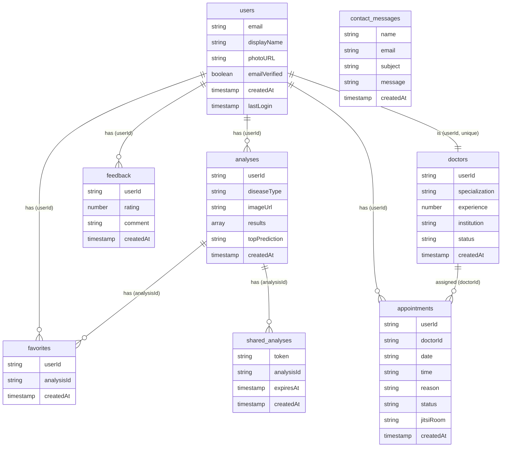

# Gemini'ye Veri İlişkileri Diyagramı Oluşturma Prompt'u

## ÖNEMLİ NOT - WATERMARK SORUNU:

Gemini görsellerinde sağ alt köşede watermark ekleniyor. Bu sorunu çözmek için:
1. Prompt'ta watermark olmamasını açıkça belirt
2. Alttan ekstra boşluk bırak (watermark alanı için)
3. VEYA alternatif araçlar kullan (Draw.io, Lucidchart)

## PROMPT (Gemini'ye Kopyala-Yapıştır):

```
Bir akademik bitirme projesi için veri ilişkileri diyagramı oluştur. 
Diyagram, MediAnalytica (tıbbi görüntü analizi ve tele-tıp platformu) için Firebase Firestore NoSQL veritabanı koleksiyonları arasındaki referans ilişkilerini görselleştirmelidir.

## ÖNEMLİ GEREKSİNİMLER:
- Görselde HİÇBİR watermark, logo veya amblem OLMAMALI
- Sağ alt köşede boşluk bırakma (watermark için alan bırakma)
- Alttan en az 100px boşluk bırak (watermark alanı için)
- Sadece veri ilişkileri diyagramı görünmeli, başka hiçbir marka/logo olmamalı
- Akademik rapor için kullanılacak, profesyonel görünüm

## VERİTABANI KOLEKSİYONLARI VE İLİŞKİLERİ:

### 1. `users` Koleksiyonu (Merkez)
**Açıklama:** Kullanıcı profilleri. Tüm diğer koleksiyonlar bu koleksiyona referans verir.

**Alanlar:**
- email (string, unique)
- displayName (string)
- photoURL (string)
- emailVerified (boolean)
- createdAt (timestamp)
- lastLogin (timestamp)

**İlişkiler:**
- `analyses.userId` → `users` (1:N - Bir kullanıcının birden fazla analizi olabilir)
- `favorites.userId` → `users` (1:N - Bir kullanıcının birden fazla favorisi olabilir)
- `appointments.userId` → `users` (1:N - Bir kullanıcının birden fazla randevusu olabilir)
- `doctors.userId` → `users` (1:1 - Bir kullanıcı bir doktor olabilir, unique)
- `feedback.userId` → `users` (1:N - Bir kullanıcının birden fazla geri bildirimi olabilir)

### 2. `analyses` Koleksiyonu
**Açıklama:** Kullanıcıların yaptığı analiz geçmişi.

**Alanlar:**
- userId (string) → `users` referansı
- diseaseType (string)
- imageUrl (string)
- results (array)
- topPrediction (string)
- gradCamUrl (string)
- createdAt (timestamp)

**İlişkiler:**
- `analyses.userId` → `users` (N:1 - Bir analiz bir kullanıcıya aittir)
- `favorites.analysisId` → `analyses` (1:N - Bir analiz birden fazla kullanıcının favorisi olabilir)
- `shared_analyses.analysisId` → `analyses` (1:N - Bir analiz birden fazla paylaşım linki olabilir)

### 3. `favorites` Koleksiyonu
**Açıklama:** Kullanıcıların favori analizleri.

**Alanlar:**
- userId (string) → `users` referansı
- analysisId (string) → `analyses` referansı
- createdAt (timestamp)

**İlişkiler:**
- `favorites.userId` → `users` (N:1 - Bir favori bir kullanıcıya aittir)
- `favorites.analysisId` → `analyses` (N:1 - Bir favori bir analize aittir)

**Not:** `userId` + `analysisId` kombinasyonu unique olmalı (bir kullanıcı aynı analizi birden fazla kez favoriye ekleyemez).

### 4. `shared_analyses` Koleksiyonu
**Açıklama:** Paylaşılan analiz linkleri.

**Alanlar:**
- token (string, unique) → Paylaşım token'ı
- analysisId (string) → `analyses` referansı
- expiresAt (timestamp)
- createdAt (timestamp)

**İlişkiler:**
- `shared_analyses.analysisId` → `analyses` (N:1 - Bir paylaşım bir analize aittir)

### 5. `appointments` Koleksiyonu
**Açıklama:** Kullanıcı randevuları.

**Alanlar:**
- userId (string) → `users` referansı
- doctorId (string, opsiyonel) → `doctors` referansı
- date (string)
- time (string)
- reason (string)
- status (string)
- jitsiRoom (string, unique)
- createdAt (timestamp)
- updatedAt (timestamp)

**İlişkiler:**
- `appointments.userId` → `users` (N:1 - Bir randevu bir kullanıcıya aittir)
- `appointments.doctorId` → `doctors` (N:1 - Bir randevu bir doktora atanabilir, opsiyonel)

### 6. `doctors` Koleksiyonu
**Açıklama:** Doktor kayıtları.

**Alanlar:**
- userId (string, unique) → `users` referansı
- specialization (string)
- experience (number)
- institution (string)
- diplomaUrl (string)
- status (string)
- createdAt (timestamp)
- updatedAt (timestamp)

**İlişkiler:**
- `doctors.userId` → `users` (1:1 - Bir doktor bir kullanıcıdır, unique)
- `appointments.doctorId` → `doctors` (1:N - Bir doktorun birden fazla randevusu olabilir)

### 7. `feedback` Koleksiyonu
**Açıklama:** Kullanıcı geri bildirimleri.

**Alanlar:**
- userId (string) → `users` referansı
- rating (number)
- comment (string)
- createdAt (timestamp)

**İlişkiler:**
- `feedback.userId` → `users` (N:1 - Bir geri bildirim bir kullanıcıya aittir)

### 8. `contact_messages` Koleksiyonu
**Açıklama:** İletişim form mesajları.

**Alanlar:**
- name (string)
- email (string)
- subject (string)
- message (string)
- createdAt (timestamp)

**İlişkiler:**
- İlişki yok (bağımsız koleksiyon)

## İLİŞKİ TİPLERİ:

### 1. One-to-Many (1:N)
- `users` → `analyses` (Bir kullanıcının birden fazla analizi)
- `users` → `favorites` (Bir kullanıcının birden fazla favorisi)
- `users` → `appointments` (Bir kullanıcının birden fazla randevusu)
- `users` → `feedback` (Bir kullanıcının birden fazla geri bildirimi)
- `analyses` → `favorites` (Bir analiz birden fazla kullanıcının favorisi olabilir)
- `analyses` → `shared_analyses` (Bir analiz birden fazla paylaşım linki olabilir)
- `doctors` → `appointments` (Bir doktorun birden fazla randevusu)

### 2. One-to-One (1:1)
- `users` ↔ `doctors` (Bir kullanıcı bir doktor olabilir, unique)

### 3. Many-to-One (N:1)
- `analyses.userId` → `users` (Bir analiz bir kullanıcıya aittir)
- `favorites.userId` → `users` (Bir favori bir kullanıcıya aittir)
- `favorites.analysisId` → `analyses` (Bir favori bir analize aittir)
- `shared_analyses.analysisId` → `analyses` (Bir paylaşım bir analize aittir)
- `appointments.userId` → `users` (Bir randevu bir kullanıcıya aittir)
- `appointments.doctorId` → `doctors` (Bir randevu bir doktora atanabilir)
- `feedback.userId` → `users` (Bir geri bildirim bir kullanıcıya aittir)

## DİYAGRAM GEREKSİNİMLERİ:

- **Koleksiyonları kutular içinde göster:**
  - Her koleksiyon için bir kutu
  - Kutu içinde koleksiyon adı ve önemli alanlar
  - `users` koleksiyonu merkezde (en büyük kutu)

- **İlişkileri oklarla göster:**
  - 1:N ilişkiler: Tek ok (1 tarafından N tarafına)
  - 1:1 ilişkiler: Çift yönlü ok veya tek ok
  - N:1 ilişkiler: Tek ok (N tarafından 1 tarafına)

- **İlişki etiketleri:**
  - Her ok üzerinde ilişki tipi (1:N, 1:1, N:1)
  - Referans alan adı (örn: "userId", "analysisId")

- **Renk kodlaması:**
  - `users` koleksiyonu: Mavi (merkez)
  - `analyses` koleksiyonu: Yeşil
  - `favorites` koleksiyonu: Turuncu
  - `shared_analyses` koleksiyonu: Mor
  - `appointments` koleksiyonu: Pembe
  - `doctors` koleksiyonu: Sarı
  - `feedback` koleksiyonu: Kırmızı
  - `contact_messages` koleksiyonu: Gri (bağımsız)

- **Oklar:**
  - 1:N ilişkiler: Kalın ok (1 tarafından N tarafına)
  - N:1 ilişkiler: İnce ok (N tarafından 1 tarafına)
  - 1:1 ilişkiler: Çift yönlü ok veya tek ok

- **Modern, profesyonel ve akademik görünüm:**
  - Temiz tasarım
  - Okunabilir font boyutları
  - Renkli ama profesyonel
  - Başlık: "MediAnalytica - Veri İlişkileri Diyagramı"

## DİYAGRAM YAPISI (Örnek):

```
        ┌─────────────┐
        │   users     │ (Merkez - Mavi)
        │  (email)    │
        │  (displayName)│
        └─────────────┘
              │
        ┌─────┼─────┬─────┬─────┐
        │     │     │     │     │
    ┌───▼───┐ │ ┌───▼───┐ │ ┌───▼───┐
    │analyses│ │ │favorites│ │ │appointments│
    │(userId)│ │ │(userId) │ │ │(userId)   │
    └───┬───┘ │ └───┬───┘ │ └───┬───┘
        │     │     │     │     │
        │     │ ┌───▼───┐ │ ┌───▼───┐
        │     │ │shared_│ │ │doctors│
        │     │ │analyses│ │ │(userId)│
        │     │ └───────┘ │ └───────┘
        │     │           │
    ┌───▼───┐ │       ┌───▼───┐
    │feedback│ │       │contact│
    │(userId)│ │       │messages│
    └───────┘ │       └───────┘
              │
```

## ÇIKTI FORMATI:

- PNG veya JPG formatında
- Yüksek çözünürlük (300 DPI)
- Akademik rapor için uygun
- WATERMARK OLMAMALI - Alttan 100px boşluk bırak
- Sadece veri ilişkileri diyagramı görünmeli
- Profesyonel görünüm
- Türkçe veya İngilizce etiketler kullanılabilir
```

## ALTERNATİF YÖNTEMLER (WATERMARK SORUNU İÇİN):

### 1. Draw.io (diagrams.net) - ÖNERİLEN ⭐⭐⭐
**Watermark YOK, tamamen ücretsiz**

1. **https://app.diagrams.net/** adresine git
2. "Create New Diagram" → "Blank Diagram"
3. **Koleksiyonları oluştur:**
   - Her koleksiyon için bir kutu çiz
   - `users` koleksiyonunu merkeze yerleştir (en büyük)
   - Diğer koleksiyonları etrafına yerleştir
4. **İlişkileri oklarla göster:**
   - 1:N ilişkiler: Tek ok (1 tarafından N tarafına)
   - N:1 ilişkiler: Tek ok (N tarafından 1 tarafına)
   - 1:1 ilişkiler: Çift yönlü ok
5. **Etiketleri ekle:**
   - Her ok üzerinde ilişki tipi (1:N, N:1, 1:1)
   - Referans alan adı (userId, analysisId, vb.)
6. **Formatla:**
   - Her koleksiyon için farklı renk
   - Okları farklı kalınlıklarda göster
   - Başlık ekle
7. **Export → PNG** (watermark YOK!)

### 2. Lucidchart
**Watermark YOK (ücretsiz plan)**

1. https://www.lucidchart.com/ adresine git
2. "Create New Diagram" → "Entity Relationship Diagram"
3. ERD şablonunu kullan
4. Koleksiyonları ve ilişkileri ekle
5. Export → PNG (watermark YOK)

### 3. Mermaid (Kod ile)
**Watermark YOK, GitHub'da otomatik render**

Aşağıdaki Mermaid kodunu kullan:



Bu kodu GitHub'da veya Mermaid Live Editor'da (https://mermaid.live/) kullan.

### 4. Microsoft Visio / PowerPoint
**Watermark YOK (Office paketi varsa)**

1. Visio veya PowerPoint'i aç
2. Entity Relationship Diagram şablonunu kullan
3. Koleksiyonları ve ilişkileri ekle
4. Export → PNG (watermark YOK)

## ÖNERİLEN ADIMLAR:

### Seçenek 1: Gemini ile (Watermark sorunu var)
1. Prompt'u Gemini'ye gönder
2. Watermark'ı kırp veya alttan boşluk bırak
3. Veya görsel düzenleme programı ile watermark'ı kaldır

### Seçenek 2: Draw.io ile (ÖNERİLEN - Watermark YOK) ⭐
1. https://app.diagrams.net/ adresine git
2. Veri ilişkileri diyagramı oluştur
3. Export → PNG (watermark YOK)
4. Raporuna ekle

### Seçenek 3: Mermaid ile (Watermark YOK)
1. Yukarıdaki Mermaid kodunu kopyala
2. https://mermaid.live/ adresine git
3. Kodu yapıştır ve PNG olarak export et
4. Raporuna ekle

## WATERMARK KALDIRMA YÖNTEMLERİ:

Eğer Gemini'den görsel aldıysan ve watermark varsa:

1. **Görsel Düzenleme Programı ile:**
   - Photoshop, GIMP, Canva gibi programlarla watermark'ı kırp
   - Veya alttan 100px kes

2. **Online Araçlar:**
   - https://www.remove.bg/ (watermark kaldırma)
   - https://www.iloveimg.com/crop-image (kırpma)

3. **En İyi Çözüm:**
   - Draw.io kullan (watermark YOK, tamamen ücretsiz)

## DİYAGRAM RENKLERİ (Önerilen):

- **users:** Mavi (#2196F3) - Merkez koleksiyon
- **analyses:** Yeşil (#4CAF50)
- **favorites:** Turuncu (#FF9800)
- **shared_analyses:** Mor (#9C27B0)
- **appointments:** Pembe (#E91E63)
- **doctors:** Sarı (#FFC107)
- **feedback:** Kırmızı (#F44336)
- **contact_messages:** Gri (#9E9E9E) - Bağımsız

## İLİŞKİ ÖZETİ:

- **users** → 5 koleksiyona referans verir (analyses, favorites, appointments, doctors, feedback)
- **analyses** → 2 koleksiyona referans verir (favorites, shared_analyses)
- **doctors** → 1 koleksiyona referans verir (appointments)
- **contact_messages** → Hiçbir koleksiyona referans vermez (bağımsız)


