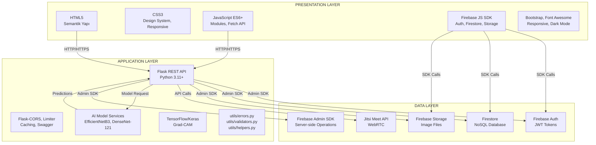

# Katmanlı Mimari Yapısı Diyagramı - Hızlı Şablon

## ⚠️ WATERMARK SORUNU ÇÖZÜMÜ:

Gemini görsellerinde watermark çıkıyor. **EN İYİ ÇÖZÜM: Draw.io kullan** (watermark YOK, tamamen ücretsiz)

## YÖNTEM 1: Draw.io (ÖNERİLEN - Watermark YOK) ⭐⭐⭐

### Adımlar:
1. **https://app.diagrams.net/** adresine git
2. "Create New Diagram" → "Blank Diagram"
3. **Üç katmanı oluştur:**
   - **Presentation Layer (üstte):** Büyük kutu çiz
   - **Application Layer (ortada):** Büyük kutu çiz
   - **Data Layer (altta):** Büyük kutu çiz
4. **Her katmanın içine bileşenleri ekle:**
   - **Presentation:**
     - HTML5, CSS3, JavaScript ES6+
     - Firebase JS SDK
     - Bootstrap, Font Awesome
     - Responsive Design, Dark Mode
   - **Application:**
     - Flask REST API
     - Flask-CORS, Limiter, Caching
     - AI Model Services (EfficientNetB3, DenseNet-121)
     - TensorFlow/Keras
     - utils/errors.py, utils/validators.py, utils/helpers.py
   - **Data:**
     - Firebase Auth
     - Firestore (NoSQL)
     - Firebase Storage
     - Jitsi Meet API
     - Firebase Admin SDK
5. **Okları ekle:**
   - HTTP/HTTPS istekleri (mavi)
   - Firebase SDK çağrıları (yeşil)
   - Admin SDK çağrıları (turuncu)
   - Model prediction (mor)
6. **Formatla ve Export → PNG** (watermark YOK!)

## YÖNTEM 2: Mermaid (Kod ile - Watermark YOK)

### Mermaid Kodu:



### Kullanım:
1. **https://mermaid.live/** adresine git
2. Yukarıdaki kodu yapıştır
3. PNG olarak export et (watermark YOK!)

## YÖNTEM 3: Gemini ile (Watermark sorunu var)

### Kısa Prompt:

```
Akademik rapor için katmanlı mimari yapısı diyagramı oluştur.

Üç katmanlı mimari (her katmanın iç bileşenleri detaylı):

1. PRESENTATION LAYER (üstte):
   - HTML5, CSS3, JavaScript ES6+
   - Firebase JS SDK
   - Bootstrap, Font Awesome
   - Responsive Design, Dark Mode

2. APPLICATION LAYER (ortada):
   - Flask REST API (Python 3.11+)
   - Flask-CORS, Limiter, Caching
   - AI Model Services (EfficientNetB3, DenseNet-121)
   - TensorFlow/Keras, Grad-CAM
   - utils/errors.py, utils/validators.py, utils/helpers.py

3. DATA LAYER (altta):
   - Firebase Auth (JWT Tokens)
   - Firestore (NoSQL Database)
   - Firebase Storage (Image Files)
   - Jitsi Meet API (WebRTC)
   - Firebase Admin SDK

Katmanlar arası iletişim:
- HTTP/HTTPS (Presentation → Application)
- Firebase SDK (Presentation → Data)
- Admin SDK (Application → Data)
- Model Prediction (Application → AI Models)

ÖNEMLİ: 
- WATERMARK OLMAMALI
- Alttan 100px boşluk bırak
- Sağ alt köşede boşluk bırak
- Her katmanın iç bileşenleri detaylı gösterilmeli

Format: Profesyonel, akademik, PNG, yüksek çözünürlük.
```

### Watermark Kaldırma:
1. Görsel düzenleme programı ile alttan 100px kes
2. Veya Draw.io kullan (daha iyi)

## YÖNTEM 4: Lucidchart (Watermark YOK)

1. https://www.lucidchart.com/ adresine git
2. "Create New Diagram" → "Blank Diagram"
3. Şekilleri sürükle-bırak ile ekle
4. Okları bağlantı çizgileri ile ekle
5. Export → PNG (watermark YOK)

## HIZLI KARŞILAŞTIRMA:

| Yöntem | Watermark | Zorluk | Kalite | Önerilen |
|--------|-----------|--------|--------|----------|
| Draw.io | ❌ YOK | ⭐ Kolay | ⭐⭐⭐ Yüksek | ✅ EVET |
| Mermaid | ❌ YOK | ⭐⭐ Orta | ⭐⭐⭐ Yüksek | ✅ EVET |
| Lucidchart | ❌ YOK | ⭐ Kolay | ⭐⭐⭐ Yüksek | ✅ EVET |
| Gemini | ⚠️ VAR | ⭐ Çok Kolay | ⭐⭐ Orta | ❌ HAYIR |

## ÖNERİLEN ADIMLAR:

1. **Draw.io kullan** (en kolay, watermark YOK) ⭐
2. Veya Mermaid kodu kullan (watermark YOK)
3. Veya Lucidchart kullan (watermark YOK)
4. Gemini'den görsel alırsan watermark'ı kırp

## DİYAGRAM YAPISI (Görsel Şablon):

```
┌─────────────────────────────────────────────────────────────┐
│              PRESENTATION LAYER                             │
│  ┌──────────────┐  ┌──────────────┐  ┌──────────────┐    │
│  │  HTML5       │  │  CSS3        │  │  JavaScript   │    │
│  │  Semantik    │  │  Design      │  │  ES6+ Modules │    │
│  │  Yapı        │  │  System      │  │  Fetch API    │    │
│  └──────────────┘  └──────────────┘  └──────────────┘    │
│  ┌──────────────┐  ┌──────────────┐  ┌──────────────┐    │
│  │  Firebase    │  │  Bootstrap    │  │  Responsive   │    │
│  │  JS SDK      │  │  Font Awesome│  │  Dark Mode   │    │
│  └──────────────┘  └──────────────┘  └──────────────┘    │
└─────────────────────────────────────────────────────────────┘
                    ↓ HTTP/HTTPS (Mavi Ok)
┌─────────────────────────────────────────────────────────────┐
│              APPLICATION LAYER                              │
│  ┌──────────────┐  ┌──────────────┐  ┌──────────────┐    │
│  │  Flask REST  │  │  Flask-CORS   │  │  Flask-       │    │
│  │  API         │  │  Limiter      │  │  Caching      │    │
│  └──────────────┘  └──────────────┘  └──────────────┘    │
│  ┌──────────────┐  ┌──────────────┐  ┌──────────────┐    │
│  │  AI Models   │  │  TensorFlow/  │  │  Grad-CAM    │    │
│  │  EfficientNet│  │  Keras        │  │  Visualization│    │
│  └──────────────┘  └──────────────┘  └──────────────┘    │
│  ┌──────────────┐  ┌──────────────┐  ┌──────────────┐    │
│  │  utils/      │  │  utils/       │  │  utils/       │    │
│  │  errors.py   │  │  validators.py│  │  helpers.py   │    │
│  └──────────────┘  └──────────────┘  └──────────────┘    │
└─────────────────────────────────────────────────────────────┘
                    ↓ Admin SDK (Turuncu Ok)
┌─────────────────────────────────────────────────────────────┐
│              DATA LAYER                                     │
│  ┌──────┐  ┌──────┐  ┌──────┐  ┌──────┐  ┌──────┐        │
│  │Auth  │  │Store│  │Storage│  │Jitsi │  │Admin │        │
│  │JWT   │  │NoSQL│  │Files  │  │Meet  │  │SDK   │        │
│  └──────┘  └──────┘  └──────┘  └──────┘  └──────┘        │
└─────────────────────────────────────────────────────────────┘
```

## KATMAN DETAYLARI:

### Presentation Layer:
- **HTML5:**
  - Semantik yapı (header, nav, main, section, footer)
  - Form elementleri
  - Meta tags

- **CSS3:**
  - Design System (CSS Variables)
  - Responsive media queries
  - Dark Mode
  - Animations

- **JavaScript ES6+:**
  - ES Modules
  - Fetch API
  - LocalStorage

- **Firebase JS SDK:**
  - Authentication
  - Firestore
  - Storage

- **Kütüphaneler:**
  - Bootstrap 4
  - Font Awesome
  - jsPDF

### Application Layer:
- **Flask REST API:**
  - Python 3.11+
  - Route decorators
  - JSON serialization

- **Flask Extensions:**
  - Flask-CORS
  - Flask-Limiter
  - Flask-Caching
  - Flask-Swagger-UI

- **AI Model Services:**
  - EfficientNetB3 (Deri)
  - DenseNet-121 (Kemik)
  - TensorFlow/Keras
  - Grad-CAM

- **Utility Modülleri:**
  - utils/errors.py
  - utils/validators.py
  - utils/helpers.py

### Data Layer:
- **Firebase Authentication:**
  - Email/Password
  - JWT tokens
  - Email verification

- **Firebase Firestore:**
  - NoSQL database
  - Real-time sync
  - Collections: users, analyses, favorites, appointments

- **Firebase Storage:**
  - Image files
  - Profile photos
  - Security rules

- **Jitsi Meet API:**
  - WebRTC video conferencing
  - Room ID generation

- **Firebase Admin SDK:**
  - Server-side operations
  - Token verification
  - Database operations

## RENK ÖNERİLERİ:

- **Presentation Layer:** Açık mavi (#E3F2FD)
- **Application Layer:** Açık yeşil (#E8F5E9)
- **Data Layer:** Açık turuncu (#FFF3E0)
- **HTTP Okları:** Mavi (#2196F3)
- **Firebase SDK Okları:** Yeşil (#4CAF50)
- **Admin SDK Okları:** Turuncu (#FF9800)
- **Model Prediction Okları:** Mor (#9C27B0)


