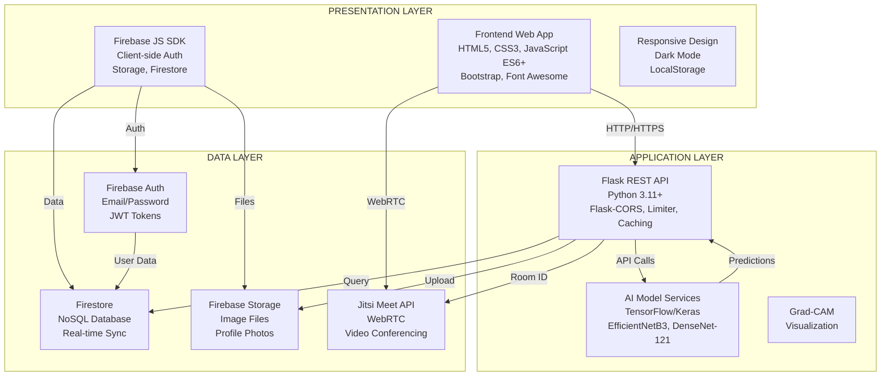

# Sistem Genel Mimarisi Diyagramı - Hızlı Şablon

## ⚠️ WATERMARK SORUNU ÇÖZÜMÜ:

Gemini görsellerinde watermark çıkıyor. **EN İYİ ÇÖZÜM: Draw.io kullan** (watermark YOK, tamamen ücretsiz)

## YÖNTEM 1: Draw.io (ÖNERİLEN - Watermark YOK) ⭐⭐⭐

### Adımlar:
1. **https://app.diagrams.net/** adresine git
2. "Create New Diagram" → "Blank Diagram"
3. **Üç katmanı oluştur:**
   - **Presentation Layer (üstte):** Büyük kutu çiz
   - **Application Layer (ortada):** Büyük kutu çiz
   - **Data Layer (altta):** Büyük kutu çiz
4. **Bileşenleri ekle:**
   - Presentation: Frontend, Firebase JS SDK
   - Application: Flask API, AI Models
   - Data: Firebase Auth, Firestore, Storage, Jitsi
5. **Okları ekle:**
   - HTTP istekleri (mavi)
   - Authentication (yeşil)
   - Veri akışı (turuncu)
   - WebRTC (mor)
6. **Formatla ve Export → PNG** (watermark YOK!)

## YÖNTEM 2: Mermaid (Kod ile - Watermark YOK)

### Mermaid Kodu:



### Kullanım:
1. **https://mermaid.live/** adresine git
2. Yukarıdaki kodu yapıştır
3. PNG olarak export et (watermark YOK!)

## YÖNTEM 3: Gemini ile (Watermark sorunu var)

### Kısa Prompt:

```
Akademik rapor için sistem genel mimarisi diyagramı oluştur.

Üç katmanlı mimari:
1. PRESENTATION LAYER (üstte):
   - Frontend Web App (HTML5, CSS3, JavaScript)
   - Firebase JS SDK
   - Responsive Design

2. APPLICATION LAYER (ortada):
   - Flask REST API (Python, Flask-CORS, Limiter)
   - AI Model Services (TensorFlow, EfficientNetB3, DenseNet-121)

3. DATA LAYER (altta):
   - Firebase Auth
   - Firestore (NoSQL)
   - Firebase Storage
   - Jitsi Meet API

ÖNEMLİ: 
- WATERMARK OLMAMALI
- Alttan 100px boşluk bırak
- Sağ alt köşede boşluk bırak
- Sadece mimari diyagram görünmeli

Format: Profesyonel, akademik, PNG, yüksek çözünürlük.
```

### Watermark Kaldırma:
1. Görsel düzenleme programı ile alttan 100px kes
2. Veya Draw.io kullan (daha iyi)

## YÖNTEM 4: Lucidchart (Watermark YOK)

1. https://www.lucidchart.com/ adresine git
2. "Create New Diagram" → "Blank Diagram"
3. Şekilleri sürükle-bırak ile ekle
4. Okları bağlantı çizgileri ile ekle
5. Export → PNG (watermark YOK)

## HIZLI KARŞILAŞTIRMA:

| Yöntem | Watermark | Zorluk | Kalite | Önerilen |
|--------|-----------|--------|--------|----------|
| Draw.io | ❌ YOK | ⭐ Kolay | ⭐⭐⭐ Yüksek | ✅ EVET |
| Mermaid | ❌ YOK | ⭐⭐ Orta | ⭐⭐⭐ Yüksek | ✅ EVET |
| Lucidchart | ❌ YOK | ⭐ Kolay | ⭐⭐⭐ Yüksek | ✅ EVET |
| Gemini | ⚠️ VAR | ⭐ Çok Kolay | ⭐⭐ Orta | ❌ HAYIR |

## ÖNERİLEN ADIMLAR:

1. **Draw.io kullan** (en kolay, watermark YOK) ⭐
2. Veya Mermaid kodu kullan (watermark YOK)
3. Veya Lucidchart kullan (watermark YOK)
4. Gemini'den görsel alırsan watermark'ı kırp

## DİYAGRAM YAPISI (Görsel Şablon):

```
┌─────────────────────────────────────────────────────────────┐
│              PRESENTATION LAYER                             │
│  ┌──────────────┐  ┌──────────────┐  ┌──────────────┐    │
│  │  Frontend    │  │  Firebase    │  │  Responsive   │    │
│  │  HTML/CSS/JS │  │  JS SDK      │  │  Design       │    │
│  └──────────────┘  └──────────────┘  └──────────────┘    │
└─────────────────────────────────────────────────────────────┘
                    ↓ HTTP/HTTPS (Mavi Ok)
┌─────────────────────────────────────────────────────────────┐
│              APPLICATION LAYER                              │
│  ┌──────────────┐  ┌──────────────┐  ┌──────────────┐    │
│  │  Flask REST  │  │  AI Model    │  │  Rate Limit   │    │
│  │  API         │  │  Services    │  │  & Caching   │    │
│  └──────────────┘  └──────────────┘  └──────────────┘    │
└─────────────────────────────────────────────────────────────┘
                    ↓ API Calls (Turuncu Ok)
┌─────────────────────────────────────────────────────────────┐
│              DATA LAYER                                     │
│  ┌──────┐  ┌──────┐  ┌──────┐  ┌──────┐  ┌──────┐        │
│  │Auth  │  │Store│  │Storage│  │Jitsi │  │Admin │        │
│  └──────┘  └──────┘  └──────┘  └──────┘  └──────┘        │
└─────────────────────────────────────────────────────────────┘
```

## KATMAN DETAYLARI:

### Presentation Layer:
- **Frontend Web App:**
  - HTML5, CSS3, JavaScript (ES6+)
  - Bootstrap 4, Font Awesome
  - Responsive tasarım, Dark Mode
  - Ana sayfalar: login.html, analyze.html, appointment.html

- **Firebase JS SDK:**
  - Client-side authentication
  - Storage ve Firestore erişimi
  - Real-time synchronization

### Application Layer:
- **Flask REST API:**
  - Python 3.11+
  - Flask-CORS, Flask-Limiter, Flask-Caching
  - JWT token doğrulama
  - Input validation, error handling

- **AI Model Services:**
  - EfficientNetB3 (Deri hastalıkları)
  - DenseNet-121 (Kemik hastalıkları)
  - TensorFlow/Keras
  - Grad-CAM görselleştirme

### Data Layer:
- **Firebase Authentication:**
  - Email/Password
  - JWT tokens
  - Email verification

- **Firebase Firestore:**
  - NoSQL database
  - Real-time sync
  - Collections: users, analyses, favorites, appointments

- **Firebase Storage:**
  - Image files
  - Profile photos
  - Security rules

- **Jitsi Meet API:**
  - WebRTC video conferencing
  - Room ID generation

## RENK ÖNERİLERİ:

- **Presentation Layer:** Açık mavi (#E3F2FD)
- **Application Layer:** Açık yeşil (#E8F5E9)
- **Data Layer:** Açık turuncu (#FFF3E0)
- **HTTP Okları:** Mavi (#2196F3)
- **Auth Okları:** Yeşil (#4CAF50)
- **Data Okları:** Turuncu (#FF9800)
- **WebRTC Okları:** Mor (#9C27B0)


