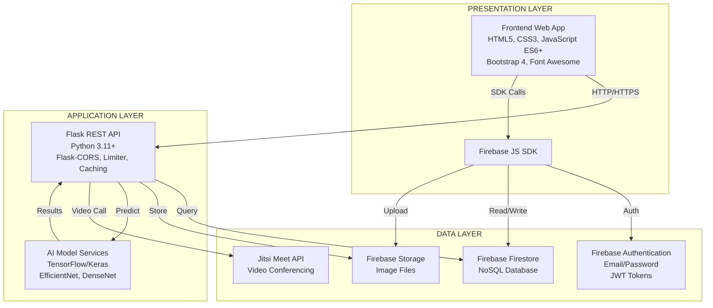
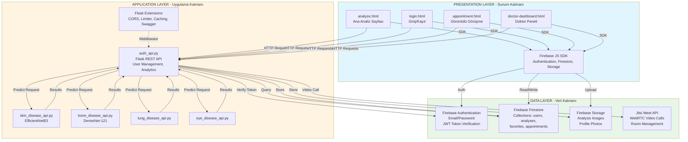

# Sistem Mimarisi Diyagramı - Mermaid Kodu

Bu kodu Mermaid editöründe (https://mermaid.live/) veya GitHub'da kullanabilirsin.

## Basit Versiyon:

## Detaylı Versiyon (Daha Fazla Bileşen):

## Kullanım:

1. **Mermaid Live Editor:** https://mermaid.live/ adresine git
2. Kodu yapıştır
3. "Actions" → "Download PNG" ile indir
4. Raporuna ekle

## Veya GitHub'da:

Markdown dosyasında bu kodu kullan, GitHub otomatik render eder.

