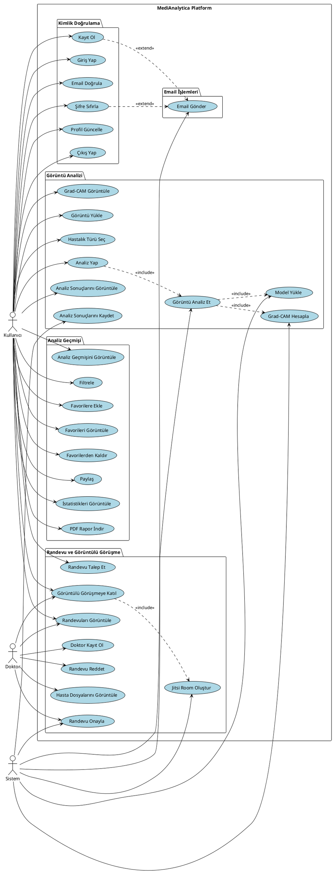
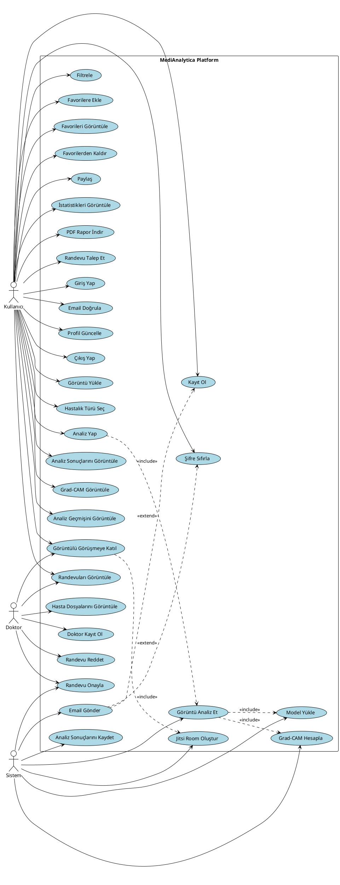

# Use Case Diyagramı - PlantUML Kodu

Bu kodu https://www.plantuml.com/plantuml/uml/ adresinde render edebilirsin.

## Basit Versiyon:

## Detaylı Versiyon (Tüm Use Case'ler):

## Kullanım:

1. **PlantUML Online Editor:** https://www.plantuml.com/plantuml/uml/
2. Kodu yapıştır
3. "Submit" butonuna tıkla
4. Diyagram görünecek
5. Sağ tık → "Save image as" ile PNG olarak kaydet

## Veya Draw.io ile:

1. https://app.diagrams.net/ adresine git
2. "Create New Diagram" → "Blank Diagram"
3. Sol panelden "UML" → "Use Case" şekillerini seç
4. Aktörleri ekle (stick figure)
5. Use case'leri ekle (oval)
6. İlişkileri çiz
7. Export → PNG

