# Veri Akışı Diyagramı - Hızlı Şablon

## ⚠️ WATERMARK SORUNU ÇÖZÜMÜ:

Gemini görsellerinde watermark çıkıyor. **EN İYİ ÇÖZÜM: Draw.io kullan** (watermark YOK, tamamen ücretsiz)

## YÖNTEM 1: Draw.io (ÖNERİLEN - Watermark YOK) ⭐⭐⭐

### Adımlar:
1. **https://app.diagrams.net/** adresine git
2. "Create New Diagram" → "Flowchart"
3. **Dört senaryoyu oluştur:**
   - Senaryo 1: Kullanıcı Kayıt/Giriş
   - Senaryo 2: Görüntü Analizi
   - Senaryo 3: Analiz Geçmişi
   - Senaryo 4: Randevu ve Görüntülü Görüşme
4. **Her senaryo için akış diyagramı çiz:**
   - Başlangıç noktası (oval): Kullanıcı
   - İşlem adımları (dikdörtgen): Frontend, Backend, Firebase
   - Bitiş noktası (oval): Sonuç
5. **Okları ekle ve etiketle:**
   - HTTP istekleri (mavi, "JSON" etiketi)
   - Firebase SDK (yeşil, "Token" etiketi)
   - Admin SDK (turuncu, "Query" etiketi)
   - Model prediction (mor, "Results" etiketi)
   - WebRTC (pembe, "Video Stream" etiketi)
6. **Formatla ve Export → PNG** (watermark YOK!)

## YÖNTEM 2: Mermaid (Kod ile - Watermark YOK)

### Mermaid Kodu:

```mermaid
graph TB
    subgraph S1["SENARYO 1: Kullanıcı Kayıt/Giriş"]
        A1[Kullanıcı] -->|email, password| A2[Frontend login.html]
        A2 -->|createUserWithEmailAndPassword| A3[Firebase Auth]
        A3 -->|ID Token| A4[Frontend localStorage]
        A4 -->|Authorization: Bearer| A5[Backend auth_api.py]
        A5 -->|verify_id_token| A6[Firebase Admin SDK]
        A6 -->|User Data| A7[Firestore users]
    end
    
    subgraph S2["SENARYO 2: Görüntü Analizi"]
        B1[Kullanıcı] -->|image file| B2[Frontend analyze.html]
        B2 -->|FormData POST| B3[Backend skin_disease_api.py]
        B3 -->|preprocessing| B4[AI Model EfficientNetB3]
        B4 -->|predictions| B5[Backend JSON response]
        B5 -->|results| B6[Frontend display]
        B6 -->|POST /api/user/analyses| B7[Backend auth_api.py]
        B7 -->|upload image| B8[Firebase Storage]
        B8 -->|download URL| B9[Firestore analyses]
    end
    
    subgraph S3["SENARYO 3: Analiz Geçmişi"]
        C1[Kullanıcı] -->|GET request| C2[Frontend analyze.html]
        C2 -->|GET /api/user/analyses| C3[Backend auth_api.py]
        C3 -->|verify_id_token| C4[Firebase Admin SDK]
        C4 -->|Firestore query| C5[Firestore analyses]
        C5 -->|JSON response| C6[Frontend display history]
    end
    
    subgraph S4["SENARYO 4: Randevu ve Görüntülü Görüşme"]
        D1[Kullanıcı] -->|appointment form| D2[Frontend analyze.html]
        D2 -->|POST /api/appointments| D3[Backend auth_api.py]
        D3 -->|create appointment| D4[Firestore appointments]
        D4 -->|appointmentId, jitsiRoom| D5[Frontend appointment.html]
        D5 -->|GET /api/appointments/id/join| D6[Backend Jitsi URL]
        D6 -->|WebRTC| D7[Jitsi Meet]
        D7 -->|Video/Audio Stream| D8[Görüntülü Görüşme]
    end
```



### Kullanım:
1. **https://mermaid.live/** adresine git
2. Yukarıdaki kodu yapıştır
3. PNG olarak export et (watermark YOK!)

## YÖNTEM 3: Gemini ile (Watermark sorunu var)

### Kısa Prompt:

```
Akademik rapor için veri akışı diyagramı oluştur.

Dört senaryo:

1. Kullanıcı Kayıt/Giriş:
   Kullanıcı → Frontend → Firebase Auth → Token → Backend → Firestore

2. Görüntü Analizi:
   Kullanıcı → Frontend → Backend API → AI Model → Results → Firebase Storage → Firestore

3. Analiz Geçmişi:
   Kullanıcı → Frontend → Backend → Firestore Query → JSON Response → Frontend

4. Randevu ve Görüntülü Görüşme:
   Kullanıcı → Frontend → Backend → Firestore → Jitsi Meet → WebRTC → Görüntülü Görüşme

ÖNEMLİ: 
- WATERMARK OLMAMALI
- Alttan 100px boşluk bırak
- Sağ alt köşede boşluk bırak
- Her senaryo adım adım gösterilmeli
- Oklar üzerinde veri formatları belirtilmeli (JSON, Token, FormData, vb.)

Format: Profesyonel, akademik, PNG, yüksek çözünürlük.
```

### Watermark Kaldırma:
1. Görsel düzenleme programı ile alttan 100px kes
2. Veya Draw.io kullan (daha iyi)

## YÖNTEM 4: Lucidchart (Watermark YOK)

1. https://www.lucidchart.com/ adresine git
2. "Create New Diagram" → "Flowchart"
3. Akış diyagramı şablonunu kullan
4. Senaryoları ekle
5. Export → PNG (watermark YOK)

## HIZLI KARŞILAŞTIRMA:

| Yöntem | Watermark | Zorluk | Kalite | Önerilen |
|--------|-----------|--------|--------|----------|
| Draw.io | ❌ YOK | ⭐ Kolay | ⭐⭐⭐ Yüksek | ✅ EVET |
| Mermaid | ❌ YOK | ⭐⭐ Orta | ⭐⭐⭐ Yüksek | ✅ EVET |
| Lucidchart | ❌ YOK | ⭐ Kolay | ⭐⭐⭐ Yüksek | ✅ EVET |
| Gemini | ⚠️ VAR | ⭐ Çok Kolay | ⭐⭐ Orta | ❌ HAYIR |

## ÖNERİLEN ADIMLAR:

1. **Draw.io kullan** (en kolay, watermark YOK) ⭐
2. Veya Mermaid kodu kullan (watermark YOK)
3. Veya Lucidchart kullan (watermark YOK)
4. Gemini'den görsel alırsan watermark'ı kırp

## SENARYO DETAYLARI:

### Senaryo 1: Kullanıcı Kayıt/Giriş
- **Adımlar:** 7 adım
- **Bileşenler:** Kullanıcı, Frontend, Firebase Auth, Backend, Firestore
- **Veri Formatları:** JSON (email, password), Token, User Data

### Senaryo 2: Görüntü Analizi
- **Adımlar:** 11 adım
- **Bileşenler:** Kullanıcı, Frontend, Backend API, AI Model, Firebase Storage, Firestore
- **Veri Formatları:** FormData (image), JSON (results), Image File

### Senaryo 3: Analiz Geçmişi
- **Adımlar:** 6 adım
- **Bileşenler:** Kullanıcı, Frontend, Backend, Firebase Admin SDK, Firestore
- **Veri Formatları:** HTTP GET, Token, JSON (analyses array)

### Senaryo 4: Randevu ve Görüntülü Görüşme
- **Adımlar:** 11 adım
- **Bileşenler:** Kullanıcı, Frontend, Backend, Firestore, Jitsi Meet
- **Veri Formatları:** JSON (appointment data), WebRTC (video stream)

## DİYAGRAM YAPISI (Görsel Şablon):

### Senaryo 1: Kullanıcı Kayıt/Giriş
```
[Kullanıcı]
    ↓ (email, password)
[Frontend login.html]
    ↓ (createUserWithEmailAndPassword)
[Firebase Auth]
    ↓ (ID Token)
[Frontend localStorage]
    ↓ (Authorization: Bearer token)
[Backend auth_api.py]
    ↓ (verify_id_token)
[Firebase Admin SDK]
    ↓ (User Data)
[Firestore users]
```

### Senaryo 2: Görüntü Analizi
```
[Kullanıcı]
    ↓ (image file, disease type)
[Frontend analyze.html]
    ↓ (FormData - HTTP POST)
[Backend skin_disease_api.py]
    ↓ (preprocessing)
[AI Model EfficientNetB3]
    ↓ (predictions, Grad-CAM)
[Backend JSON response]
    ↓ (results)
[Frontend display results]
    ↓ (POST /api/user/analyses)
[Backend auth_api.py]
    ↓ (upload image)
[Firebase Storage]
    ↓ (download URL)
[Firestore analyses]
```

### Senaryo 3: Analiz Geçmişi
```
[Kullanıcı]
    ↓ (GET request)
[Frontend analyze.html]
    ↓ (GET /api/user/analyses + Bearer token)
[Backend auth_api.py]
    ↓ (verify_id_token)
[Firebase Admin SDK]
    ↓ (Firestore query)
[Firestore analyses]
    ↓ (JSON response)
[Frontend display history]
```

### Senaryo 4: Randevu ve Görüntülü Görüşme
```
[Kullanıcı]
    ↓ (appointment form)
[Frontend analyze.html]
    ↓ (POST /api/appointments)
[Backend auth_api.py]
    ↓ (create appointment + Jitsi Room ID)
[Firestore appointments]
    ↓ (appointmentId, jitsiRoom)
[Frontend appointment.html]
    ↓ (GET /api/appointments/{id}/join)
[Backend Jitsi Meet URL]
    ↓ (WebRTC)
[Jitsi Meet]
    ↓ (Video/Audio Stream)
[Görüntülü Görüşme]
```

## RENK ÖNERİLERİ:

- **Frontend:** Açık mavi (#E3F2FD)
- **Backend:** Açık yeşil (#E8F5E9)
- **Firebase:** Açık turuncu (#FFF3E0)
- **AI Models:** Açık mor (#F3E5F5)
- **HTTP Okları:** Mavi (#2196F3)
- **Firebase SDK Okları:** Yeşil (#4CAF50)
- **Admin SDK Okları:** Turuncu (#FF9800)
- **Model Prediction Okları:** Mor (#9C27B0)
- **WebRTC Okları:** Pembe (#E91E63)

## İLETİŞİM PROTOKOLLERİ:

1. **HTTP/HTTPS:** Tüm API istekleri
2. **REST:** RESTful API tasarımı
3. **JSON:** API istekleri ve yanıtları
4. **FormData:** Dosya yükleme
5. **WebSocket/WebRTC:** Jitsi Meet görüntülü görüşme


