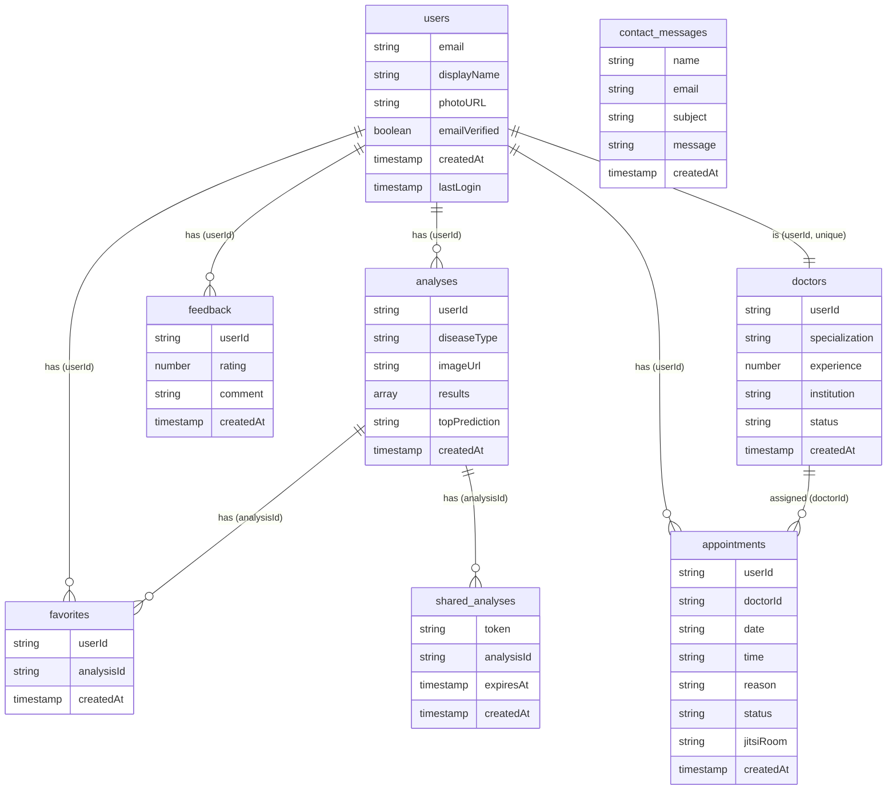

# Veri İlişkileri Diyagramı - Hızlı Şablon

## ⚠️ WATERMARK SORUNU ÇÖZÜMÜ:

Gemini görsellerinde watermark çıkıyor. **EN İYİ ÇÖZÜM: Draw.io kullan** (watermark YOK, tamamen ücretsiz)

## YÖNTEM 1: Draw.io (ÖNERİLEN - Watermark YOK) ⭐⭐⭐

### Adımlar:
1. **https://app.diagrams.net/** adresine git
2. "Create New Diagram" → "Blank Diagram"
3. **Koleksiyonları oluştur:**
   - Her koleksiyon için bir kutu çiz
   - `users` koleksiyonunu merkeze yerleştir (en büyük)
   - Diğer koleksiyonları etrafına yerleştir
4. **İlişkileri oklarla göster:**
   - 1:N ilişkiler: Tek ok (1 tarafından N tarafına)
   - N:1 ilişkiler: Tek ok (N tarafından 1 tarafına)
   - 1:1 ilişkiler: Çift yönlü ok
5. **Etiketleri ekle:**
   - Her ok üzerinde ilişki tipi (1:N, N:1, 1:1)
   - Referans alan adı (userId, analysisId, vb.)
6. **Formatla ve Export → PNG** (watermark YOK!)

## YÖNTEM 2: Mermaid (Kod ile - Watermark YOK)

### Mermaid Kodu:



### Kullanım:
1. **https://mermaid.live/** adresine git
2. Yukarıdaki kodu yapıştır
3. PNG olarak export et (watermark YOK!)

## YÖNTEM 3: Gemini ile (Watermark sorunu var)

### Kısa Prompt:

```
Akademik rapor için veri ilişkileri diyagramı oluştur.

8 koleksiyon ve ilişkileri:

1. users (merkez):
   - → analyses (1:N, userId)
   - → favorites (1:N, userId)
   - → appointments (1:N, userId)
   - → feedback (1:N, userId)
   - ↔ doctors (1:1, userId, unique)

2. analyses:
   - ← users (N:1, userId)
   - → favorites (1:N, analysisId)
   - → shared_analyses (1:N, analysisId)

3. favorites:
   - ← users (N:1, userId)
   - ← analyses (N:1, analysisId)

4. shared_analyses:
   - ← analyses (N:1, analysisId)

5. appointments:
   - ← users (N:1, userId)
   - ← doctors (N:1, doctorId)

6. doctors:
   - ↔ users (1:1, userId, unique)
   - → appointments (1:N, doctorId)

7. feedback:
   - ← users (N:1, userId)

8. contact_messages:
   - İlişki yok (bağımsız)

ÖNEMLİ: 
- WATERMARK OLMAMALI
- Alttan 100px boşluk bırak
- Sağ alt köşede boşluk bırak
- users koleksiyonu merkezde olmalı
- İlişkiler oklarla gösterilmeli

Format: Profesyonel, akademik, PNG, yüksek çözünürlük.
```

### Watermark Kaldırma:
1. Görsel düzenleme programı ile alttan 100px kes
2. Veya Draw.io kullan (daha iyi)

## YÖNTEM 4: Lucidchart (Watermark YOK)

1. https://www.lucidchart.com/ adresine git
2. "Create New Diagram" → "Entity Relationship Diagram"
3. ERD şablonunu kullan
4. Koleksiyonları ve ilişkileri ekle
5. Export → PNG (watermark YOK)

## HIZLI KARŞILAŞTIRMA:

| Yöntem | Watermark | Zorluk | Kalite | Önerilen |
|--------|-----------|--------|--------|----------|
| Draw.io | ❌ YOK | ⭐ Kolay | ⭐⭐⭐ Yüksek | ✅ EVET |
| Mermaid | ❌ YOK | ⭐⭐ Orta | ⭐⭐⭐ Yüksek | ✅ EVET |
| Lucidchart | ❌ YOK | ⭐ Kolay | ⭐⭐⭐ Yüksek | ✅ EVET |
| Gemini | ⚠️ VAR | ⭐ Çok Kolay | ⭐⭐ Orta | ❌ HAYIR |

## ÖNERİLEN ADIMLAR:

1. **Draw.io kullan** (en kolay, watermark YOK) ⭐
2. Veya Mermaid kodu kullan (watermark YOK)
3. Veya Lucidchart kullan (watermark YOK)
4. Gemini'den görsel alırsan watermark'ı kırp

## İLİŞKİ DETAYLARI:

### users (Merkez Koleksiyon):
- **1:N İlişkiler:**
  - → analyses (userId)
  - → favorites (userId)
  - → appointments (userId)
  - → feedback (userId)
- **1:1 İlişkiler:**
  - ↔ doctors (userId, unique)

### analyses:
- **N:1 İlişkiler:**
  - ← users (userId)
- **1:N İlişkiler:**
  - → favorites (analysisId)
  - → shared_analyses (analysisId)

### favorites:
- **N:1 İlişkiler:**
  - ← users (userId)
  - ← analyses (analysisId)

### shared_analyses:
- **N:1 İlişkiler:**
  - ← analyses (analysisId)

### appointments:
- **N:1 İlişkiler:**
  - ← users (userId)
  - ← doctors (doctorId, opsiyonel)

### doctors:
- **1:1 İlişkiler:**
  - ↔ users (userId, unique)
- **1:N İlişkiler:**
  - → appointments (doctorId)

### feedback:
- **N:1 İlişkiler:**
  - ← users (userId)

### contact_messages:
- **İlişki yok** (bağımsız koleksiyon)

## DİYAGRAM YAPISI (Görsel Şablon):

```
        ┌─────────────┐
        │   users     │ (Merkez - Mavi)
        │  (email)    │
        │  (displayName)│
        └─────────────┘
              │
        ┌─────┼─────┬─────┬─────┐
        │     │     │     │     │
    ┌───▼───┐ │ ┌───▼───┐ │ ┌───▼───┐
    │analyses│ │ │favorites│ │ │appointments│
    │(userId)│ │ │(userId) │ │ │(userId)   │
    └───┬───┘ │ └───┬───┘ │ └───┬───┘
        │     │     │     │     │
        │     │ ┌───▼───┐ │ ┌───▼───┐
        │     │ │shared_│ │ │doctors│
        │     │ │analyses│ │ │(userId)│
        │     │ └───────┘ │ └───────┘
        │     │           │
    ┌───▼───┐ │       ┌───▼───┐
    │feedback│ │       │contact│
    │(userId)│ │       │messages│
    └───────┘ │       └───────┘
              │
```

## RENK ÖNERİLERİ:

- **users:** Mavi (#2196F3) - Merkez koleksiyon
- **analyses:** Yeşil (#4CAF50)
- **favorites:** Turuncu (#FF9800)
- **shared_analyses:** Mor (#9C27B0)
- **appointments:** Pembe (#E91E63)
- **doctors:** Sarı (#FFC107)
- **feedback:** Kırmızı (#F44336)
- **contact_messages:** Gri (#9E9E9E) - Bağımsız

## İLİŞKİ ÖZETİ:

- **Toplam İlişki:** 11 ilişki
- **1:N İlişkiler:** 7 adet
- **N:1 İlişkiler:** 7 adet
- **1:1 İlişkiler:** 1 adet (users ↔ doctors)
- **Bağımsız Koleksiyon:** 1 adet (contact_messages)

## İLİŞKİ NOTASYONU:

- **||--o{** : One-to-Many (1:N)
- **}o--||** : Many-to-One (N:1)
- **||--||** : One-to-One (1:1)
- **--** : İlişki yok


